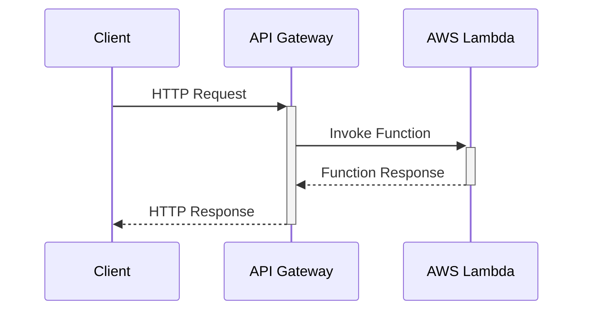
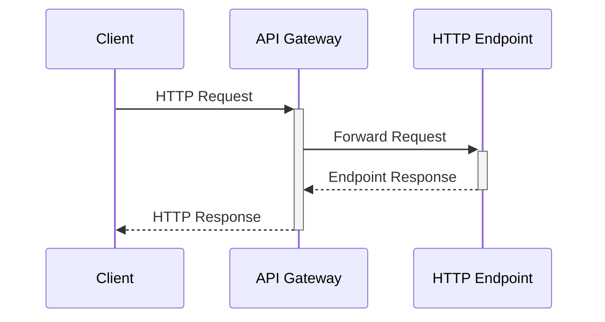
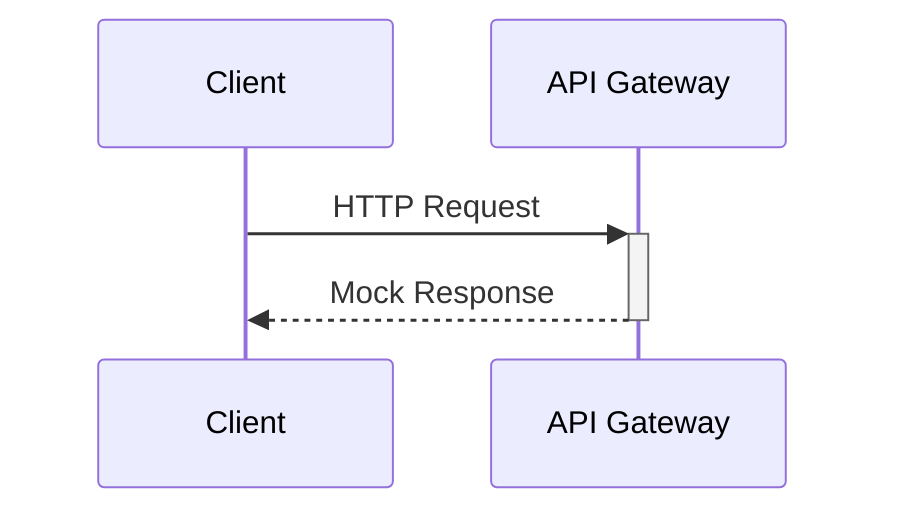
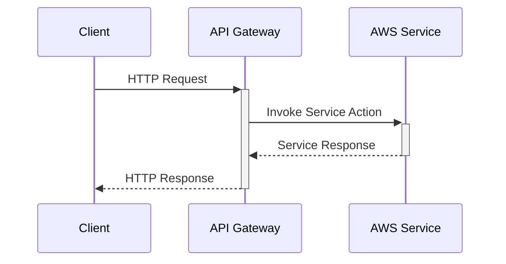
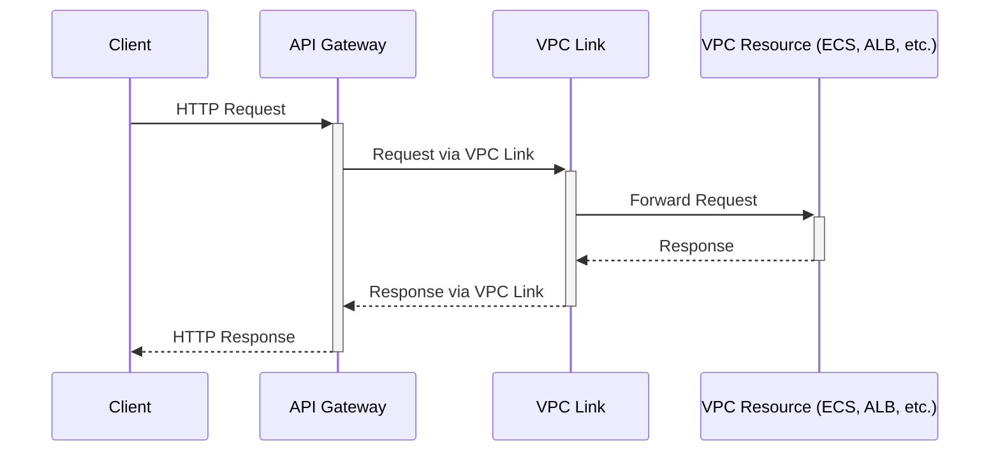

---

> This is my second article about `Amazon API Gateway`. You can find the other one here: [Amazon API Gateway exposed: choosing the right endpoint strategy for your API](/posts/amazon-api-gateway-exposed/){:target="_blank"}. 
> 
> Neither of these articles is an introductory piece on Amazon API Gateway.
{: .prompt-info }

## Introduction

API Gateway is much more than integrating it with Lambda Functions and in this article I want to `explore all the available types of integrations`:
- AWS Lambda Functions
- HTTP endpoints
- Mock responses based on API Gateway mappings and transformations.
- AWS services
- Private services through VPC links


## Lambda Function Integration

Among the various integration options available in Amazon API Gateway, integrating with AWS Lambda functions is, by far, `the most popular and commonly utilized approach`. This popularity stems from the seamless synergy between API Gateway and AWS Lambda, offering developers a highly scalable, flexible, and serverless execution model. This integration empowers you to build and deploy serverless applications that can scale automatically with demand, without the need to provision or manage servers.

AWS Lambda integration allows API Gateway to invoke Lambda functions in response to HTTP requests. This serverless execution model enables you to run code for virtually any type of application or backend service with zero administration.

**Options**: there are 2 options for integrations, using a proxy or not.
  - Using a proxy: This option automatically passes all the details of an HTTP request (headers, body, and query parameters) directly to the Lambda function, and the output from the Lambda function is returned to the client as an HTTP response. This setup simplifies the integration by allowing the Lambda function to handle the parsing of the incoming request and the formatting of the outgoing response. It's particularly useful for quickly setting up APIs without needing to define specific request and response models.
  - Without proxy: This approach offers more control over the integration request and response transformations between API Gateway and the Lambda function. You can specify custom mappings using Velocity Template Language (VTL) to transform the incoming request before it reaches the Lambda function and to format the Lambda function's response before it is sent back to the client. This method is suitable for scenarios where you need to adapt the request or response format according to specific requirements.

### Key Features

- Automatic scaling: Lambda functions automatically scale with the number of requests.
- Cost-effective: You pay only for the compute time you consume.
- Seamless integration: Easily set up API endpoints to invoke Lambda functions with minimal configuration.

### Diagram



### Performance

High performance with automatic scaling. 

### Security

It is managed through IAM roles and policies.

### Cost

Costs are based on the number of requests and the duration of code execution. There's no charge for the Lambda integration itself, but the AWS Lambda pricing applies.

### Use cases

- Data processing
- Real-time processing
- Serverless backend services

### Example

Imagine you have a Lambda function that processes order data. The function expects a JSON payload with order details. However, your API receives orders in XML format. With a custom (non-proxy) integration, you can set up a request template in API Gateway to convert the XML payload into a JSON format that the Lambda function can process. Similarly, if the Lambda function returns JSON that you need to convert back to XML for the client, you can define a response template in API Gateway to perform this transformation.

### Code
    
```yaml
Resources:
    MyApi:
        Type: AWS::ApiGateway::RestApi
        Properties:
        Name: LambdaProxyApi
    MyLambdaIntegration:
        Type: AWS::ApiGateway::Method
        Properties:
        HttpMethod: POST
        ResourceId: !Ref MyApiResource
        RestApiId: !Ref MyApi
        Integration:
            IntegrationHttpMethod: POST
            Type: AWS_PROXY
            Uri: arn:aws:apigateway:{region}:lambda:path/2015-03-31/functions/{lambda_function_arn}/invocations
```

## HTTP Integrations

HTTP integrations enable API Gateway to `act as a proxy for HTTP endpoints`. This includes integration with HTTP-enabled AWS services, external HTTP APIs, and microservices.

> Can I use HTTP integration to integrate with AWS services? But exist one `AWS Services` integration type. What is then the difference?
> 
> The HTTP integration is more generic and versatile, allowing for RESTful API calls to any HTTP-based service, whether hosted on AWS or externally. It's `particularly useful for integrating with HTTP APIs of AWS services not directly supported by AWS Service Integrations` or for connecting with third-party APIs and microservices.
{: .prompt-tip }

### Key Features

- Flexibility: Connect to any HTTP endpoint, AWS-hosted or externally hosted.
- Efficiency: Reduce latency by directly integrating your API with HTTP-supported applications or services.
- Generic HTTP Proxy: Uses standard HTTP methods and integrates with services that may not have native API Gateway integrations.

### Diagram



### Performance

It depends on the targeted HTTP endpoint. 

### Security

Use HTTPS to secure data in transit.

### Cost

There's no additional charge for HTTP integrations beyond the API Gateway's standard request pricing. However, data transfer and any specific charges by the HTTP endpoint service apply.

### Use cases

- Third-party API Integration
- Microservices Architecture (ECS, EC2, or any external hosting service)
- Content Delivery and Management

### Example

Suppose you want to integrate your API Gateway with a third-party weather service API to fetch weather updates. The weather service provides an HTTP endpoint that accepts GET requests with a city name as a query parameter and returns weather data in JSON format.

### Code

```yaml
Resources:
    MyApi:
        Type: AWS::ApiGateway::RestApi
        Properties:
        Name: HttpProxyApi
    MyHttpIntegration:
        Type: AWS::ApiGateway::Method
        Properties:
        HttpMethod: GET
        ResourceId: !Ref MyApiResource
        RestApiId: !Ref MyApi
        Integration:
            IntegrationHttpMethod: GET
            Type: HTTP_PROXY
            Uri: https://example.com/endpoint
```

## Mock Integrations

Mock integrations allow you to `simulate API behavior without backend integration`. With mock integrations, you can return a fixed response to the API caller directly from API Gateway, facilitating the validation of API definitions and client-side development independent of the backend.

### Key Features

- Rapid prototyping: Quickly mock API responses for client development without the need for a backend.
- Testing: Test and validate API deployment and response types.

### Diagram



### Performance

Instant response, as no backend processing is required. 

### Security

Through API Gateway's standard mechanisms.

### Cost

Costs are incurred based on the number of API calls, with no additional charges for the mock integration feature itself.

### Use cases

- API Prototyping and Testing
- Static Data Responses
- Error Simulation

### Example

Suppose you're developing a new feature that requires API endpoints to return specific responses for frontend testing. With mock integrations, you can configure API Gateway to return a 200 status code with a sample JSON response body, such as { "message": "This is a mock response" }, allowing the frontend team to proceed with development even before the backend logic is implemented.

### Code

```yaml
Resources:
    MyApi:
        Type: AWS::ApiGateway::RestApi
        Properties:
        Name: MockApi
    MyMockIntegration:
        Type: AWS::ApiGateway::Method
        Properties:
        HttpMethod: GET
        ResourceId: !Ref MyApiResource
        RestApiId: !Ref MyApi
        Integration:
            Type: MOCK
            RequestTemplates:
            application/json: '{ "statusCode": 200 }'
            IntegrationResponses:
            - StatusCode: 200
                ResponseTemplates:
                application/json: '{"message": "mock response"}'
```

## AWS Service Integrations

AWS Service integrations allow API Gateway to `interact directly with other AWS services without writing custom integration code`. This integration simplifies architecture by enabling direct access to AWS services, such as putting an item into an Amazon DynamoDB table or publishing a message to an Amazon SNS topic directly through API Gateway.

### Key Features

- Simplicity: Simplify architecture by reducing the need for intermediate services.
- Direct access: Enable APIs to perform actions directly on AWS services.

> Difference between `AWS Services` integration and HTTP integration:
> 
> AWS Service Integrations are a subset of what you can achieve with HTTP Integrations but offer a more integrated, AWS-centric approach simplifying the configuration by abstracting the underlying HTTP requests into AWS SDK-like actions directly within API Gateway.
{: .prompt-tip }

### Diagram



### Performance

It is highly reliable

### Security

It is handled through IAM roles and permissions.

### Cost

Similar to HTTP integrations, the cost is based on the API Gateway's request pricing. Additionally, standard operation charges for the integrated AWS service apply.

### Use case 

- Direct Database Interaction
- Notifications and Messaging
- Workflow Orchestration

### Example

To expose data from a DynamoDB table through API Gateway, you can set up an AWS Service integration to invoke the DynamoDB:Query action directly. This setup allows clients to retrieve data from the table without the need for a Lambda function as an intermediary. Similarly, to orchestrate a workflow with AWS Step Functions, you can configure integration to start an execution of a Step Functions state machine, passing input data directly through the API Gateway request.

### Code

```yaml
Resources:
    MyDynamoDBIntegration:
        Type: AWS::ApiGateway::Method
        Properties:
        HttpMethod: POST
        ResourceId: !Ref MyApiResource
        RestApiId: !Ref MyApi
        Integration:
            IntegrationHttpMethod: POST
            Type: AWS
            Uri: arn:aws:apigateway:{region}:dynamodb:action/PutItem
            Credentials: arn:aws:iam::{account_id}:role/apigateway-dynamodb
 ```

## VPC Link Integrations

VPC Link integrations enable `private integrations` that allow API Gateway to securely connect with resources within an Amazon Virtual Private Cloud (VPC). This is particularly useful for accessing HTTP endpoints hosted within your VPC without exposing them to the public internet.

### Key Features

- Security: Keep your back-end systems secure by not exposing them to the public internet.
- Private access: Access resources within your VPC from your API Gateway API.

### Diagram



### Performance

It depends on the network configuration and the backend services. 

### Security

Enhanced security as it allows access to resources within a VPC without exposing them to the internet.

### Cost

Pricing includes an hourly charge for each VPC link, plus data processed charges. This is in addition to the API Gateway's standard request pricing.

### Use cases

- Private services within a VPC

### Example

If you have a microservice running on Amazon ECS that's exposed via an Application Load Balancer (ALB) within your VPC, you can use VPC Link to create a secure connection between the API Gateway and the ALB. This setup allows API Gateway to route requests to your ECS service without exposing the service to the public internet. To achieve this, create a VPC Link in the API Gateway pointing to your ALB, and then configure your API's integration request to route through the VPC Link.

### Code

```yaml
Resources:
    MyVPCLink:
        Type: AWS::ApiGateway::VpcLink
        Properties:
        Name: MyVPCLink
        TargetArns:
            - arn:aws:elasticloadbal
```

## Conclusion

In closing, Amazon API Gateway stands out as a robust gateway for API management, offering a diverse range of integration options to connect with AWS services, HTTP endpoints, and private resources securely and efficiently. Its versatility in handling different integration patterns makes it an essential tool for developers looking to build scalable, secure, and highly available applications in the AWS cloud. As you explore these integration capabilities, consider the specific requirements of your application and choose the integration type that best fits your architectural needs. By leveraging API Gateway's full potential, you can simplify your backend services and create more agile and responsive applications.

This is the comparison table for all the options:

| Integration Type      | Key Features                                           | Performance            | Security                          | Cost Implications                                  | Ideal Use Cases                                  |
|-----------------------|--------------------------------------------------------|------------------------|-----------------------------------|---------------------------------------------------|-------------------------------------------------|
| **AWS Lambda**        | - Automatic scaling<br>- Cost-effective<br>- Seamless integration | High with auto-scaling | Managed through IAM roles and policies | Based on request count and compute time          | - Data processing<br>- Real-time processing<br>- Serverless backend services |
| **HTTP Endpoints**    | - Flexibility<br>- Efficiency<br>- Generic HTTP Proxy                | Depends on endpoint    | Use HTTPS for security            | Standard request pricing plus data transfer fees | - Third-party API integration<br>- Microservices architecture<br>- Content delivery |
| **Mock Integrations** | - Rapid prototyping<br>- No backend required                        | Instant response       | API Gateway standard mechanisms   | Incurred based on number of API calls            | - API prototyping and testing<br>- Static data responses<br>- Error simulation |
| **AWS Services**      | - Simplify architecture<br>- Direct access to AWS services          | Highly reliable        | IAM roles and permissions         | Request pricing plus AWS service charges         | - Direct database interaction<br>- Notifications and messaging<br>- Workflow orchestration |
| **VPC Link**          | - Secure access to VPC resources<br>- No public internet exposure    | Depends on network     | Enhanced within VPC                | Hourly charge for VPC link plus data charges     | - Accessing private services within a VPC       |
