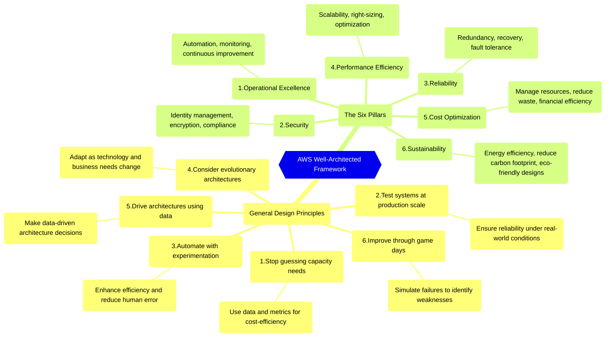
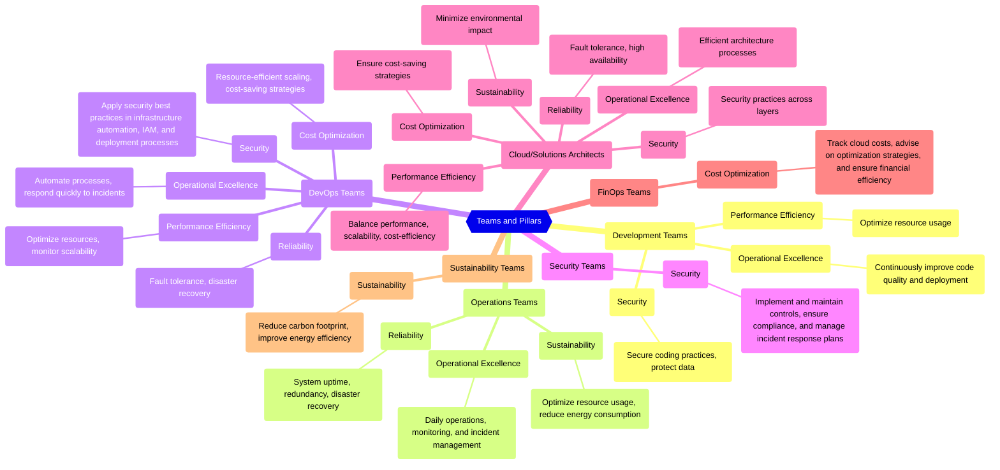
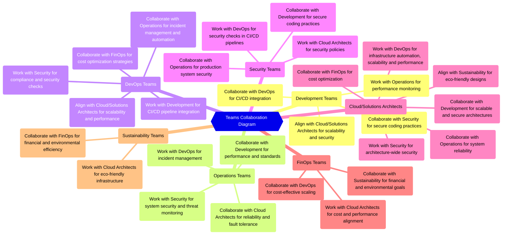

> This article is part of a series about `AWS Well-Architected`. As I was writing, I realized there was so much more to share that it made sense to break it into a series.
>
> 1/4: **Overview of the AWS Well-Architected Framework** (this article): Learn why the AWS Well-Architected Framework is essential for every cloud professional and how it can set your cloud architecture up for success.
>
> 2/4: [Deep Dive: Six Pillars](/posts/the-six-pillars-of-aws-well-architected-framework-best-practices-for-cloud-success/){:target="_blank"}: Dive into the details of the Six Pillars, uncovering the best practices for building secure, resilient, and cost-efficient cloud systems.
>
> 3/4: Quick Wins for Each Pillar [TO BE CREATED]: Discover actionable quick wins for each AWS Well-Architected Pillar, helping you optimize cloud performance, security, and cost-efficiency.
>
> 4/4: AWS Well-Architected Tool [TO BE CREATED]: A practical guide to using the AWS Well-Architected Tool to assess, improve, and continuously optimize your workloads, with screenshots and step-by-step guidance.
{: .prompt-tip }

---

- [1. Introduction](#1-introduction)
- [2. Understanding the AWS Well-Architected Framework](#2-understanding-the-aws-well-architected-framework)
  - [2.1. General Design Principles](#21-general-design-principles)
  - [2.2. The Six Pillars](#22-the-six-pillars)
  - [2.3. Visualizing the concepts](#23-visualizing-the-concepts)
- [3. Who Should Focus on What and How? Aligning the Pillars with Your Role](#3-who-should-focus-on-what-and-how-aligning-the-pillars-with-your-role)
  - [3.1. Development Teams](#31-development-teams)
  - [3.2. Operations Teams](#32-operations-teams)
  - [3.3. DevOps Teams](#33-devops-teams)
  - [3.4. Security Teams](#34-security-teams)
  - [3.5. Cloud/Solutions Architects](#35-cloudsolutions-architects)
  - [3.6. FinOps Teams](#36-finops-teams)
  - [3.7. Sustainability Teams](#37-sustainability-teams)
  - [3.8. Visualizing Role-Pillar Relations and Team Collaboration](#38-visualizing-role-pillar-relations-and-team-collaboration)
- [4. Conclusion](#4-conclusion)

---

## 1. Introduction

When creating cloud systems, it's crucial to focus on key factors like `security`, `efficiency`, `reliability`, `scalability`, and `cost-effectiveness`. However, there's one more factor that is becoming increasingly important: `sustainability`.

> Sustainability matters! It's not just about your cloud, it's about your future!
{: .prompt-warning }

But `how` do we create systems that follow all these principles?

The `AWS Well-Architected Framework` provides the tools you need to evaluate and improve these key areas, offering structured guidance based on AWS best practices. These best practices aren’t just AWS-specific. They are derived from industry standards and can be applied across any cloud environment.

> `Why` is this framework important? If you’re building on AWS, wouldn’t it make sense to follow AWS's own recommendations to build scalable, secure, and cost-efficient systems?
>
> Are you ensuring your cloud infrastructure is as secure and scalable as it can be? The AWS Well-Architected Framework is your guide to make that happen!
{: .prompt-tip }

In this article, we’ll explore the key benefits of the AWS Well-Architected Framework and why it’s essential for anyone working with cloud technology.

---

## 2. Understanding the AWS Well-Architected Framework

> This is your path to the Cloud Excellence.
{: .prompt-tip }

The `AWS Well-Architected Framework` is a set of best practices and design principles for building cloud architectures that are scalable, secure, reliable, and efficient. By following this framework, you ensure that your cloud architecture is positioned to handle current and future challenges.

The framework is structured into two key components:

1. General Design Principles
2. The Six Pillars

### 2.1. General Design Principles

These principles form the foundation of cloud architecture and provide general guidance that applies to any workload, regardless of specific needs. They are not tied to a particular AWS service or use case, making them universally applicable across cloud environments.

1. **Stop guessing your capacity needs**: Use data and metrics to determine the right capacity, ensuring flexibility and cost-efficiency.
2. **Test systems at production scale**: Build environments that mirror production to ensure reliability under real-world conditions.
3. **Automate with architectural experimentation in mind**: Leverage automation to enhance efficiency and reduce human error across your infrastructure.
4. **Consider evolutionary architectures**: Enable systems to evolve as technology and business requirements change.
5. **Drive architectures using data**: Make architecture decisions based on concrete data rather than assumptions.
6. **Improve through game days**: Simulate failure scenarios to stress-test your architecture and identify weaknesses for improvement.

### 2.2. The Six Pillars

The Six Pillars represent the core areas that guide your focus when building well-architected cloud solutions. Each pillar comes with specific design principles and best practices to help you optimize your workload.

1. **Operational Excellence**: Focuses on `automation`, `monitoring`, and `continuous improvement` to ensure operational efficiency.
2. **Security**: Encompasses `identity management`, `encryption`, and `compliance` measures to protect your data and workloads.
3. **Reliability**: Ensures `redundancy`, `recovery`, and `fault tolerance` so that your systems remain functional under failure conditions.
4. **Performance Efficiency**: Prioritizes `scalability`, `right-sizing`, and `optimization` to ensure resources are used effectively as demand changes.
5. **Cost Optimization**: Focuses on `managing resources`, `reducing waste`, and `improving financial efficiency` to maximize cloud investments.
6. **Sustainability**: Aims to enhance `energy efficiency`, `reduce carbon footprint`, and design `eco-friendly architectures` that align with corporate responsibility goals.

You will find the detailed information on these pillars in the next article of the series (each pillar has its own set of design principles and best practices).

> The General Design Principles set the foundation for your cloud architecture, while the Six Pillars focus on building specific aspects of your strategy.
{: .prompt-info }

### 2.3. Visualizing the concepts

---

## 3. Who Should Focus on What and How? Aligning the Pillars with Your Role

The AWS Well-Architected Framework applies to everyone involved in cloud systems, whether you're designing, managing, or optimizing them. Each role has specific pillars that are most important to their daily responsibilities.

Here’s a breakdown of how different roles can align with the AWS Well-Architected Pillars, with practical examples and simplified role collaborations:

### 3.1. Development Teams

- **Pillars**:
  - **Operational Excellence**: Continuously improve code quality and deployment processes.
    > *Example: Developers can follow best practices for error handling, logging, and automated testing to ensure code is resilient, maintainable, and contributes to a smooth, error-free deployment process.*
  - **Security**: Implement secure coding practices and protect data at the application level.
    > *Example: Developers can integrate AWS Systems Manager Parameter Store or AWS Secrets Manager (depending on organizational policies) to securely store and retrieve sensitive configuration data like API keys and credentials.*
  - **Performance Efficiency**: Optimize application performance, select scalable architecture patterns, and right-size compute resources.
    > *Example: Developers can implement caching strategies within the application, using services like Amazon ElastiCache to reduce latency and optimize database queries.*
  
- **Collaboration**:
  - with `Operations` teams to ensure performance metrics are properly monitored.
  - with `DevOps` to ensure that CI/CD pipelines are automated and reliable.
  - with `Security` to ensure that secure coding practices and compliance measures are integrated early in the development cycle.
  - with `Cloud/Solutions Architects` to ensure that architecture choices support scalability, security, and fault tolerance.

### 3.2. Operations Teams

- **Pillars**:
  - **Operational Excellence**: Focus on daily operations, monitoring, and incident management.
    > *Example: Operations teams can set up CloudWatch alarms for CPU or memory thresholds, ensuring that performance issues are flagged immediately, and incidents are managed quickly to avoid downtime.*
  - **Reliability**: Maintain system uptime, redundancy, and disaster recovery.
    > *Example: Operations teams use AWS Backup to schedule regular backups, ensuring that critical data is protected and can be restored quickly in case of system failure.*
  - **Sustainability**: Manage resource utilization and reduce energy consumption during operations.
    > *Example: Operations teams can use Amazon CloudWatch to monitor underutilized instances and right-size them, reducing both costs and energy consumption.*

- **Collaboration**:
  - with `Development` teams to ensure that performance and reliability requirements are met.
  - with `DevOps` to ensure seamless incident management and automated deployments.
  - with `Security` to ensure that production systems adhere to security policies and are monitored for security threats.
  - with `Cloud/Solutions Architects` to implement architectural changes that improve long-term system reliability.

### 3.3. DevOps Teams

**Note**: In this role, we are also including responsibilities from the `SRE (Site Reliability Engineering)` role. DevOps teams will handle automation, CI/CD, system monitoring, and reliability improvements. This approach merges the focus on operational excellence and reliability from both DevOps and SRE perspectives.

- **Pillars**:
  - **Operational Excellence**: Focus on automation, continuous integration/continuous delivery (CI/CD), and monitoring.
    > *Example: DevOps teams can use AWS CodePipeline integrated with AWS CodeBuild to enable continuous delivery of applications, with testing automatically triggered before deployment.*
  - **Security**: Focus on applying security best practices in infrastructure automation, IAM, and deployment processes.
    > *Example: DevOps teams include security controls in the CI/CD pipelines.*
  - **Reliability**: Manage redundancy, fault tolerance, and disaster recovery planning.
    > *Example: DevOps teams configure AWS Backup with lifecycle policies that automatically transfer backups to cold storage, optimizing costs and automating recovery across different environments as part of the CI/CD pipeline.*
  - **Performance Efficiency**: Optimize resources and monitor scalability.
    > *Example: DevOps teams can configure Auto Scaling groups to automatically adjust capacity based on application load, ensuring efficient use of resources without over-provisioning.*
  - **Cost Optimization**: Implement resource-efficient scaling and cost-saving strategies.
    > *Example: By enabling AWS Savings Plans, DevOps can ensure that frequently used compute resources are cost-optimized while auto-scaling handles demand fluctuations.*

- **Collaboration**:
  - with `Development` to ensure smooth integration of code changes into production environments.
  - with `Operations` to ensure seamless incident management and automated deployments.
  - with `Security` to integrate security checks and compliance requirements into the CI/CD pipeline.
  - with `Cloud/Solutions Architects` to ensure that CI/CD pipelines align with the broader architectural goals for scalability and reliability.
  - with `FinOps` to ensure that cost optimization strategies are aligned with infrastructure automation and scaling.

### 3.4. Security Teams

- **Pillars**:
  - **Security**: Lead the effort in implementing and maintaining controls, ensuring compliance with industry standards, and managing incident response plans.
    > *Example: Security teams can use AWS Security Hub to centralize security alerts and AWS Identity and Access Management (IAM) policies to enforce the principle of least privilege across the entire organization.*

- **Collaboration**:
  - with `Development` to ensure that secure coding practices and data protection mechanisms are implemented early in the development process.
  - with `Operations` to ensure that security monitoring is in place across production systems.
  - with `DevOps` to integrate security checks and compliance requirements into the CI/CD pipeline.
  - with `Cloud/Solutions Architects` to implement security policies that cover all layers of the architecture.

### 3.5. Cloud/Solutions Architects

> **Note**: This role merges both `Cloud Architects` and `Solutions Architects`.
>
> - **Cloud Architects** focus on the technical implementation of cloud resources (such as infrastructure and cloud services).
> - **Solutions Architects** ensure the broader architectural alignment with business goals and ensure that the architecture is scalable, secure, and cost-efficient.
{: .prompt-info }

- **Pillars**:
  - **Operational Excellence**: Oversee the entire architecture, ensuring operational excellence across all areas.
    > *Example: Solutions architects can design infrastructure-as-code (IaC) solutions to automate infrastructure deployment and updates, ensuring consistent and repeatable environments across all stages of development.*
  - **Security**: Ensure security best practices are applied across the entire architecture.
    > *Example: Solutions architects can configure AWS Security Hub with the Security Best Practices Standard to continuously monitor compliance and security posture across multiple AWS accounts, providing real-time insights into potential vulnerabilities.*
  - **Reliability**: Oversee the entire system's design, ensuring reliability, fault tolerance and high availability across all services and components.
    > *Example: Solutions architects can design systems using AWS Elastic Load Balancing with health checks to ensure traffic is routed only to healthy instances, improving system reliability.*
  - **Performance Efficiency**: Ensure that all components of the architecture are performing efficiently and scaling as required.
    > *Example: Solutions architects can implement Amazon CloudFront for content delivery, reducing latency for global users and optimizing performance and costs.*
  - **Cost Optimization**: Ensure cost optimization practices are implemented across the entire architecture, balancing performance with cost.
    > *Example: Solutions architects can enable AWS Cost Explorer to provide real-time insights into spend patterns and use these insights to adjust resource usage or scale services more cost-effectively.*
  - **Sustainability**: Ensure sustainability practices are integrated across the architecture, from design to operations.
    > *Example: Solutions architects can encourage the use of serverless architecture with AWS Lambda, reducing unnecessary resource usage and minimizing the carbon footprint.*

- **Collaboration**:
  - with `Development` teams to ensure that application architectures are scalable and secure.
  - with `Operations` to ensure system reliability and that architectural updates are properly implemented.
  - with `DevOps` to ensure that infrastructure automation aligns with the broader architectural vision.
  - with `Security` to ensure security practices are implemented throughout the architecture.
  - with `FinOps` to ensure cost-saving strategies align with performance and availability requirements.
  - with `Sustainability` to align environmental goals with architectural decisions.

**Note**: Cloud/Solutions Architects `connect all teams`. They ensure that all pillars of the AWS Well-Architected Framework are considered, helping align technical implementations with both business and operational goals.

### 3.6. FinOps Teams

- **Pillars**:
  - **Cost Optimization**: Focus on tracking cloud costs, advising on optimization strategies, and ensuring financial efficiency.
    > *Example: FinOps teams can use AWS Budgets and AWS Cost Anomaly Detection to track spend anomalies, providing early insights into unusual spending patterns and allowing corrective actions before budgets are exceeded.*

- **Collaboration**:
  - with `DevOps` to ensure that cost optimization strategies are aligned with infrastructure automation and scaling.
  - with `Cloud/Solutions Architects` to ensure cost-saving strategies align with performance and availability requirements.
  - with `Sustainability` teams to ensure financial and environmental goals are integrated.

### 3.7. Sustainability Teams

- **Pillars**:
  - **Sustainability**: Lead the effort to align cloud usage with environmental goals.
    > *Example (revised): Sustainability teams can use the AWS Customer Carbon Footprint Tool to track and monitor the environmental impact of cloud usage across the organization. They guide engineering teams on adopting energy-efficient practices, like right-sizing resources and scheduling workloads to minimize unnecessary resource consumption.*

- **Collaboration**:
  - with `Cloud/Solutions Architects` to ensure sustainability goals, such as energy efficiency and minimizing environmental impact, are incorporated into cloud infrastructure designs.
  - with `FinOps` to align sustainability efforts with financial efficiency, ensuring that both cost-saving measures and eco-friendly practices work in harmony.

### 3.8. Visualizing Role-Pillar Relations and Team Collaboration

Map showing the relationship between roles (teams) and the pillars they are aligned with:

Diagram illustrating the collaboration between teams:

---

## 4. Conclusion

The AWS Well-Architected Framework is not just a set of guidelines but a powerful tool that can help you design and manage cloud workloads that are secure, reliable, efficient, and cost-effective.

This `mindmap` diagram provides a visual summary of the key concepts discussed in this article. You can also view it online [here](https://whimsical.com/aws-well-architected-framework-v1-0-LMSYMqmRpZSzV1Y8cARNH8){:target="_blank"}:

For further reading, explore AWS’s comprehensive resources:

- [AWS Well-Architected Framework](https://docs.aws.amazon.com/wellarchitected/latest/framework/welcome.html){:target="_blank"}
- [Well-Architected Labs](https://www.wellarchitectedlabs.com/){:target="_blank"}
- [Online map tool](https://wa.aws.amazon.com/wat.map.en.html){:target="_blank"}

In the next article, we’ll dive deeper into the Six Pillars, where you’ll learn the exact best practices you can start applying to your workloads today.

> [Deep Dive: Six Pillars](/posts/the-six-pillars-of-aws-well-architected-framework-best-practices-for-cloud-success/){:target="_blank"}
{: .prompt-tip }
