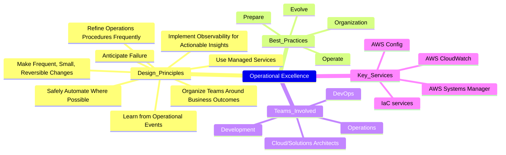
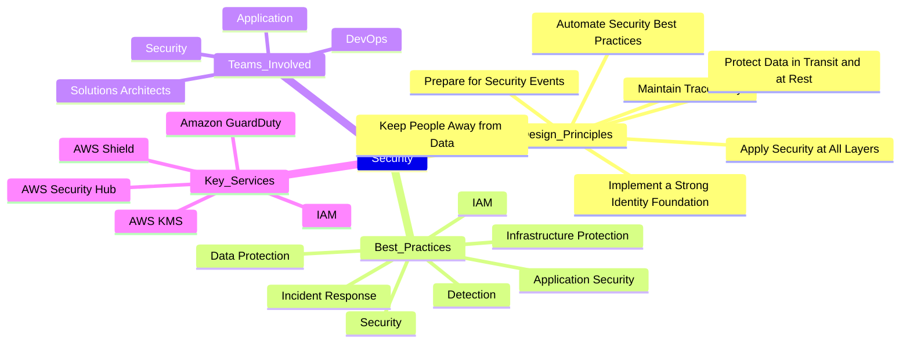
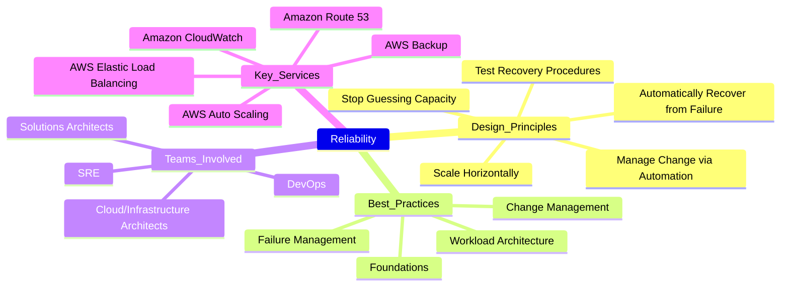
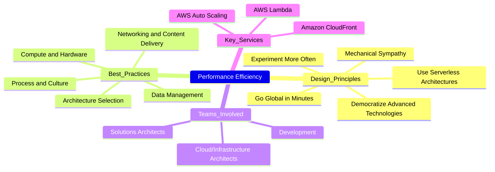
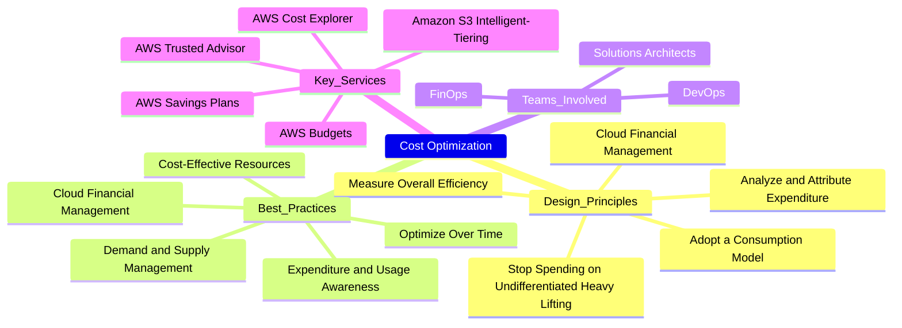
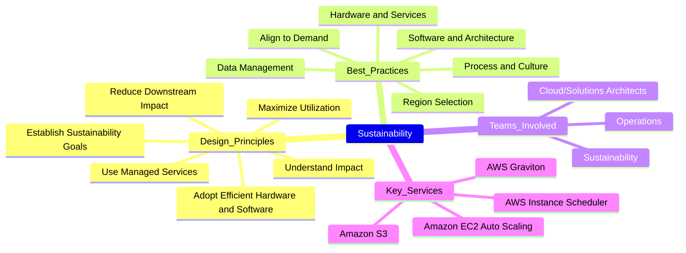

> This article is part of a series about `AWS Well-Architected`. As I was writing, I realized there was so much more to share that it made sense to break it into a series.
>
> 1/4: [Overview of the AWS Well-Architected Framework](/posts/understanding-the-aws-well-architected-framework-why-it-s-essential-for-every-cloud-professional/){:target="_blank"}: Learn why the AWS Well-Architected Framework is essential for every cloud professional and how it can set your cloud architecture up for success.
>
> 2/4: **Deep Dive: Six Pillars** (this article): Dive into the details of the Six Pillars, uncovering the best practices for building secure, resilient, and cost-efficient cloud systems.
>
> 3/4: [Quick Wins for Each Pillar](/posts/immediate-impact-quick-wins-for-each-pillar-of-the-aws-well-architected-framework/){:target="_blank"}: Discover actionable quick wins for each AWS Well-Architected Pillar, helping you optimize cloud performance, security, and cost-efficiency.
>
> 4/4: AWS Well-Architected Tool [TO BE CREATED]: A practical guide to using the AWS Well-Architected Tool to assess, improve, and continuously optimize your workloads, with screenshots and step-by-step guidance.
{: .prompt-tip }

---

- [1. Introduction](#1-introduction)
- [2. Exploring the Six Pillars](#2-exploring-the-six-pillars)
  - [2.1. Pillar of Operational Excellence](#21-pillar-of-operational-excellence)
  - [2.2. Pillar of Security](#22-pillar-of-security)
  - [2.3. Pillar of Reliability](#23-pillar-of-reliability)
  - [2.4. Pillar of Performance Efficiency](#24-pillar-of-performance-efficiency)
  - [2.5. Pillar of Cost Optimization](#25-pillar-of-cost-optimization)
  - [2.6. Pillar of Sustainability](#26-pillar-of-sustainability)
- [3. Conclusion](#3-conclusion)

---

## 1. Introduction

In this article, we'll explore best practices for each of the Six Pillars, with practical insights into how you can implement them in your AWS environment.

## 2. Exploring the Six Pillars

The Six Pillars are the foundation of the AWS Well-Architected Framework, offering essential guidance for designing cloud architectures that can adapt, scale, and operate efficiently.

In this section, you'll explore each of the pillars, along with their key design principles and best practices. This deeper dive provides you with the tools to understand how to optimize your cloud workloads.

> It’s essential reading for anyone looking to improve their cloud architecture, but if you prefer to stay high-level, feel free to skip this section.
{: .prompt-tip }

For the most up-to-date details, review the official AWS documentation [here](https://docs.aws.amazon.com/wellarchitected/latest/framework/the-pillars-of-the-framework.html){:target="_blank"}.

### 2.1. Pillar of Operational Excellence

> Focuses on `automation`, `monitoring`, and `continuous improvement` to optimize operational efficiency.
{: .prompt-info }

- **Why it’s important**:
  - Operational excellence ensures that your infrastructure adapts quickly to changes and operates efficiently. Automation and continuous improvement help streamline processes, reduce manual interventions, and improve service delivery.
  - Ignoring this pillar can lead to slow recovery times, mismanaged resources, and missed opportunities for automation, all of which increase operational overhead.

- **Design Principles** (8):
  - `Organize teams around business outcomes`: Ensure alignment between development and operations for clear ownership and accountability.
  - `Implement observability for actionable insights`: Use metrics, logs, and traces to understand your workloads’ health and performance.
  - `Safely automate where possible`: Automate tasks like patching and scaling to minimize human error and speed up operations.
  - `Make frequent, small, reversible changes`: Continuous delivery allows quick adjustments, reducing the risk of large failures.
  - `Refine operations procedures frequently`: Continuously evolve processes to adapt to new challenges.
  - `Anticipate failure`: Build resilient systems that assume components will fail and design for quick recovery.
  - `Learn from all operational events`: Conduct retrospectives to improve processes after incidents.
  - `Use managed services`: Reduce operational burden by leveraging AWS managed services that automate many operational tasks.

- **Best Practices** (4):
  - `Organization`: Establish clear ownership of services and processes.
  - `Prepare`: Automate preparations for both expected and unexpected events.
  - `Operate`: Continuously improve operational processes, such as patching and scaling.
  - `Evolve`: Refine operations based on feedback and lessons learned from past incidents.

- **Teams involved**:
  - Development: Continuously improve code quality and deployment processes.
  - Operations: Focus on daily operations, monitoring, and incident management.
  - DevOps: Focus on automation, continuous integration/continuous delivery (CI/CD), and monitoring.
  - Solutions Architects: Oversee the entire architecture, ensuring operational excellence across all areas.

- **Key Services**:
  - AWS CloudFormation / AWS CDK / AWS SAM: Infrastructure as Code (IaC) tools for automating resource provisioning and management.
  - AWS CloudWatch: Monitor performance metrics and set up alarms for operational health.
  - AWS Config: Track configuration changes and evaluate compliance.
  - AWS Systems Manager: Automate operational tasks such as patch management and resource configurations.

- **Additional information**:
  - More information about the Pillar [here](https://docs.aws.amazon.com/wellarchitected/latest/operational-excellence-pillar/welcome.html){:target="_blank"}.
  - Hands-on labs on this Pillar [here](https://www.wellarchitectedlabs.com/operational-excellence/){:target="_blank"}.

### 2.2. Pillar of Security

> Encompasses `identity management`, `encryption`, and `compliance` measures to protect your data and workloads.
{: .prompt-info }

- **Why it’s important**:
  - Security is fundamental to safeguarding your data, applications, and workloads from unauthorized access, ensuring compliance with regulations, and mitigating risks.
  - Without proper security measures, you risk data breaches, compliance violations, and significant financial and reputational damage.
  - A strong security posture not only protects your systems but also builds trust with customers.

- **Design Principles** (7):
  - `Implement a strong identity foundation`: Use the principle of least privilege to enforce permissions.
  - `Maintain traceability`: Ensure that you can track all actions in the cloud with logging and auditing.
  - `Apply security at all layers`: Implement security controls at the network, application, and data levels.
  - `Automate security best practices`: Use automation to enforce security configurations and manage resources.
  - `Protect data in transit and at rest`: Encrypt data to ensure confidentiality.
  - `Keep people away from data`: Reduce or eliminate the need for direct access or manual processing of data
  - `Prepare for security events`: Have a plan in place to respond to and recover from security incidents.

- **Best Practices** (7):
  - `Security`: Establish and enforce security measures to protect your workloads from threats.
  - `Identity and Access Management`: Manage who can access resources and under what conditions.
  - `Detection`: Implement logging and monitoring to detect and respond to security incidents quickly.
  - `Infrastructure Protection`: Secure your network and systems against unauthorized access.
  - `Data Protection`: Ensure data privacy and integrity by using encryption and key management.
  - `Incident Response`: Develop a comprehensive response strategy for potential security breaches.
  - `Application security`: Implement security controls at the application level to protect against vulnerabilities.

- **Teams involved**:
  - Development: Implement secure coding practices and protect data at the application level.
  - Security: Lead the effort in implementing and maintaining controls, ensuring compliance with industry standards, and managing incident response plans.
  - DevOps: Focus on applying security best practices in infrastructure automation, IAM, and deployment processes.
  - Cloud/Solutions Architects: Ensure security best practices are applied across the entire architecture.
    - Implement robust security practices across all layers.

- **Key Services**:
  - Identity and Access Management (IAM): Manage user permissions and access.
  - AWS Security Hub: Centralized view of security findings across AWS services.
  - Amazon GuardDuty: Continuous threat detection service.
  - AWS Shield: Protect against DDoS attacks.
  - AWS Key Management Service (KMS): Manage encryption keys to protect sensitive data.

- **Additional information**:
  - More information about this Pillar [here](https://docs.aws.amazon.com/wellarchitected/latest/security-pillar/welcome.html){:target="_blank"}.
  - Hands-on labs on this Pillar [here](https://www.wellarchitectedlabs.com/security/){:target="_blank"}.

### 2.3. Pillar of Reliability

> Ensures `redundancy`, `recovery`, and `fault tolerance` so that your systems can remain functional even under failure conditions.
{: .prompt-info }

- **Why it’s important**:
  - Reliability ensures your systems are available when customers need them.
  - Without it, outages can result in lost revenue, customer dissatisfaction, and damaged trust.
  - Designing for reliability helps you build resilient architectures that quickly recover from failures, ensuring uninterrupted service.

- **Design Principles** (5):
  - `Automatically recover from failure`: Implement self-healing systems to minimize downtime.
  - `Test recovery procedures`: Regularly test your systems' ability to recover from failure scenarios.
  - `Scale horizontally to increase availability`: Distribute the load across multiple resources to ensure redundancy.
  - `Stop guessing capacity`: Use auto-scaling to handle dynamic workloads.
  - `Manage change via automation`: Automate the deployment process to reduce manual errors.

- **Best Practices** (4):
  - `Foundations`: Design your architecture for recovery from failures.
  - `Workload architecture`: Design applications to handle disruptions through redundancy and failover mechanisms.
  - `Change Management`: Control changes to maintain reliability.
  - `Failure Management`: Prepare for and respond to failures proactively.

- **Teams involved**:
  - DevOps: Manage redundancy, fault tolerance, and disaster recovery planning.
  - Solutions Architects: Oversee the entire system's design, ensuring reliability, fault tolerance and high availability across all services and components.
  - Operations: Maintain system uptime, redundancy, and disaster recovery.

- **Key Services**:
  - Amazon CloudWatch: Monitor system health and performance metrics.
  - AWS Auto Scaling: Automatically scale resources to meet demand.
  - Amazon Route 53: Highly available DNS service with failover capability.
  - AWS Elastic Load Balancing: Distribute incoming application traffic across multiple resources.
  - AWS Backup: Centralized backup service for automating data protection.

- **Additional information**:
  - More information about this Pillar [here](https://docs.aws.amazon.com/wellarchitected/latest/reliability-pillar/welcome.html){:target="_blank"}.
  - Hands-on labs on this Pillar [here](https://www.wellarchitectedlabs.com/reliability/){:target="_blank"}.

### 2.4. Pillar of Performance Efficiency

> Prioritizes `scalability`, `right-sizing`, and `optimization` to ensure your resources are used effectively as demand changes.
{: .prompt-info }

- **Why it’s important**:
  - Performance efficiency ensures that your cloud infrastructure adapts to changing workloads while delivering a seamless user experience.
  - Without performance optimization, you risk slow response times, poor user experience, and higher-than-necessary costs.

- **Design Principles** (5):
  - `Democratize advanced technologies`: Use technology to empower teams across your organization.
  - `Go global in minutes`: Leverage the global infrastructure of AWS to reduce latency and enhance performance.
  - `Use serverless architectures`: Use serverless services to automatically handle scaling and capacity.
  - `Experiment more often`: Regularly experiment with new technologies to discover performance improvements.
  - `Mechanical sympathy`: Understand the characteristics of the underlying hardware and software to optimize performance.

- **Best Practices** (5):
  - `Architecture selection`: Choose the right resources that meet your workload’s specific requirements.
  - `Compute and hardware`: Leverage the optimal compute resources, such as EC2, Lambda, or containers, to meet performance demands.
  - `Data management`: Implement efficient data storage and retrieval strategies to enhance speed and performance.
  - `Networking and content delivery`: Use services like Amazon CloudFront to reduce latency and improve load times globally.
  - `Process and culture`: Foster a culture of performance awareness by monitoring and optimizing resource usage regularly.

- **Teams involved**:
  - Development: Optimize application performance, select scalable architecture patterns, and right-size compute resources.
  - DevOps: Optimize resources and monitor scalability.
  - Cloud/Infrastructure Architects: Ensure that all components of the architecture are performing efficiently and scaling as required.

- **Key Services**:
  - AWS Auto Scaling: Automatically adjust resource capacity based on demand.
  - AWS Lambda: Serverless compute service for scaling applications automatically.
  - Amazon CloudFront: Content delivery network (CDN) for reducing latency and improving load times globally.

- **Additional information**:
  - More information about this Pillar [here](https://docs.aws.amazon.com/wellarchitected/latest/performance-efficiency-pillar/welcome.html){:target="_blank"}.
  - Hands-on labs on this Pillar [here](https://www.wellarchitectedlabs.com/performance-efficiency/){:target="_blank"}.

### 2.5. Pillar of Cost Optimization

> Focuses on `managing resources`, `reducing waste`, and `improving financial efficiency` to maximize cloud investments.
{: .prompt-info }

- **Why it’s important**:
  - Cost optimization ensures that you are using the right resources at the right scale and paying only for what you need.
  - Without proper cost management, organizations can overspend on unused resources, which could impact profitability and limit resources for innovation.

- **Design Principles** (5):
  - `Implement Cloud Financial Manage`: Dedicate resources to managing cloud costs effectively.
  - `Adopt a consumption model`: Pay only for the resources you actually use.
  - `Measure overall efficiency`: Continuously monitor efficiency to reduce resource waste.
  - `Stop spending money on undifferentiated heavy lifting`: Automate operations and eliminate redundant tasks.
  - `Analyze and attribute expenditure`: Use tools to understand and allocate costs accurately.

- **Best Practices** (5):
  - `Practice Cloud Financial Management`: Implement governance to track and optimize cloud spending.
  - `Expenditure and usage awareness`: Monitor and analyze where your costs are incurred, ensuring efficient resource use.
  - `Cost-effective resources`: Select the appropriate instance types and services to optimize costs.
  - `Manage demand and supply resources`: Use auto-scaling to adjust resources based on workload needs.
  - `Optimize over time`: Continuously review and adjust resources to stay cost-effective as your workload evolves.

- **Teams involved**:
  - DevOps: Implement resource-efficient scaling and cost-saving strategies.
  - FinOps: Focus on tracking cloud costs, advising on optimization strategies, and ensuring financial efficiency.
  - Solutions Architects: Ensure cost optimization practices are implemented across the entire architecture, balancing performance with cost.

- **Key Services**:
  - AWS Cost Explorer: Analyze and manage AWS spending with visual reports.
  - AWS Trusted Advisor: Receive real-time guidance on optimizing resources for cost-efficiency.
  - AWS Budgets: Set custom budgets and receive alerts when you exceed cost thresholds.
  - Amazon S3 Intelligent-Tiering: Automatically move data to the most cost-effective storage tier based on usage.
  - AWS Savings Plans: Flexible pricing plans that help reduce costs for specific services.

- **Additional information**:
  - More information about this Pillar [here](https://docs.aws.amazon.com/wellarchitected/latest/cost-optimization-pillar/welcome.html){:target="_blank"}.
  - Hands-on labs on this Pillar [here](https://www.wellarchitectedlabs.com/cost-optimization/){:target="_blank"}.

### 2.6. Pillar of Sustainability

> Aims to enhance `energy efficiency`, `reduce carbon footprint`, and design `eco-friendly architectures`.
{: .prompt-info }

- **Why it’s important**:
  - Sustainability focuses on reducing the environmental impact of your cloud operations.
  - Sustainable practices help reduce your organization’s carbon footprint and improve environmental impact.
  - Without a focus on sustainability, your cloud infrastructure may consume more energy and resources than necessary, leading to higher costs and environmental harm.
  - As organizations move towards greener solutions, sustainability is becoming a crucial pillar for long-term success.

- **Design Principles** (6):
  - `Understand your impact`: Measure and analyze your cloud workloads’ environmental impact.
  - `Establish sustainability goals`: Establish long-term sustainability goals.
  - `Maximize utilization`: Right-size workloads and implement efficient design to verify high utilization and maximize the energy efficiency of the underlying hardware.
  - `Anticipate and adopt new, more efficient hardware and software offerings`: Continually monitor and evaluate new, more efficient hardware and software offerings.
  - `Use managed services`: Use AWS tools and services designed to improve sustainability.
  - `Reduce the downstream impact of your cloud workloads`: Reduce the amount of energy or resources required to use your services.

- **Best Practices** (6):
  - `Region selection`: Choose AWS regions that minimize energy consumption and carbon emissions.
  - `Alignment to demand`: Right-size your infrastructure to align with your current and forecasted usage.
  - `Software and architecture`: Design software to be resource-efficient and scalable.
  - `Data management`: Reduce data storage and processing needs to lower energy consumption.
  - `Hardware and services`: Use energy-efficient AWS services, such as serverless, to minimize resource usage.
  - `Process and culture`: Promote sustainability across teams by regularly measuring and optimizing environmental impact.

- **Teams involved**:
  - Sustainability: Lead the effort to align cloud usage with environmental goals.
  - Operations: Manage resource utilization and reduce energy consumption during operations.
  - Cloud/Solutions Architects: Ensure sustainability practices are integrated across the architecture, from design to operations.

- **Key Services**:
  - Amazon EC2 Auto Scaling: Automatically adjust compute resources based on actual demand to reduce waste.
  - AWS Graviton: Energy-efficient processors designed for high-performance workloads.
  - Amazon S3: Use energy-efficient storage, and minimize redundant data with lifecycle policies.
  - AWS Instance Scheduler: Automate start/stop times for EC2 and RDS instances to reduce energy consumption during off-hours.

- **Additional information**:
  - More information about this Pillar [here](https://docs.aws.amazon.com/wellarchitected/latest/sustainability-pillar/sustainability-pillar.html){:target="_blank"}.
  - Hands-on labs on this Pillar [here](https://www.wellarchitectedlabs.com/sustainability/){:target="_blank"}.

---

## 3. Conclusion

The AWS Well-Architected Framework is built around the Six Pillars, each of which addresses a core aspect of cloud architecture. By adopting these pillars, you ensure that your workloads are designed to meet modern standards of operational excellence, security, reliability, performance efficiency, cost optimization, and sustainability.

> Each pillar offers a comprehensive set of best practices and actionable steps. Start applying these today to gain the full value of your AWS infrastructure.
{: .prompt-tip }

This `mindmap` diagram you can find [here](https://whimsical.com/aws-well-architected-framework-v2-0-Ph6ooHugkQ8cFW2CStAmBm){:target="_blank"} summarizes and connects all the information presented in this article and in the previous one. It's big, so I didn't try to include it here.

In the next article, we’ll review actionable Quick-Wins per Pillar. It's time to take action!

> [Take Action with the Quick-Wins per Pillar](/posts/how-the-aws-well-architected-tool-can-transform-your-cloud-architecture/){:target="_blank"}
{: .prompt-tip }

For further reading, explore AWS’s comprehensive resources:

- [AWS Well-Architected Framework](https://docs.aws.amazon.com/wellarchitected/latest/framework/welcome.html){:target="_blank"}
- [Well-Architected Labs](https://www.wellarchitectedlabs.com/){:target="_blank"}
- [Online map tool](https://wa.aws.amazon.com/wat.map.en.html){:target="_blank"}
- [Labs](https://www.wellarchitectedlabs.com/){:target="_blank"}
