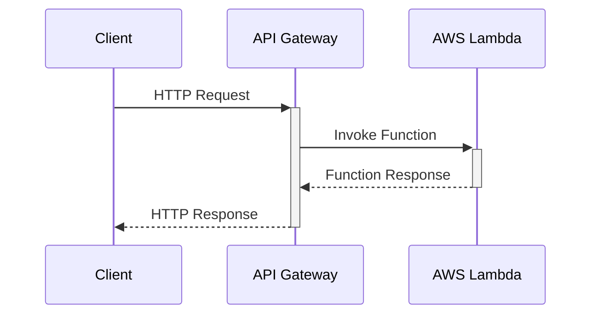
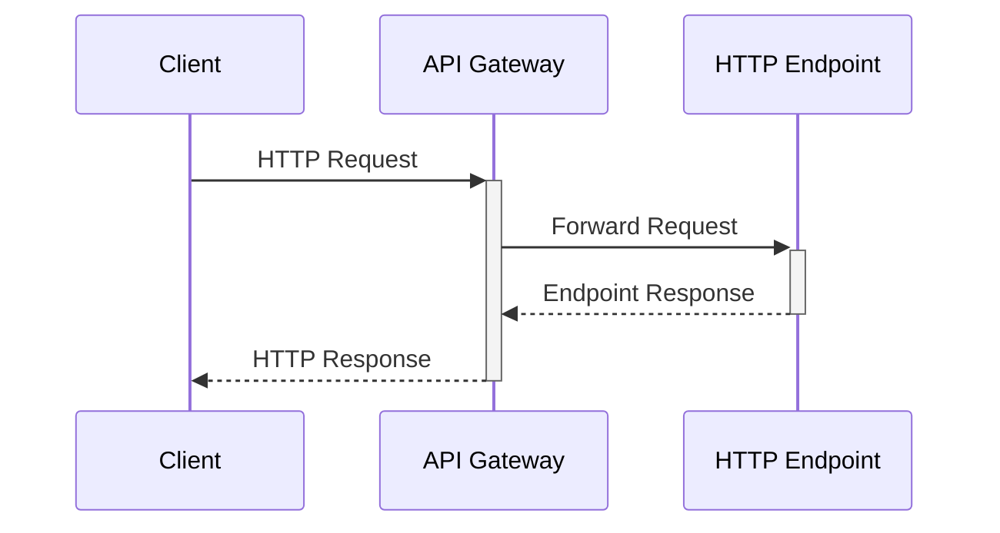
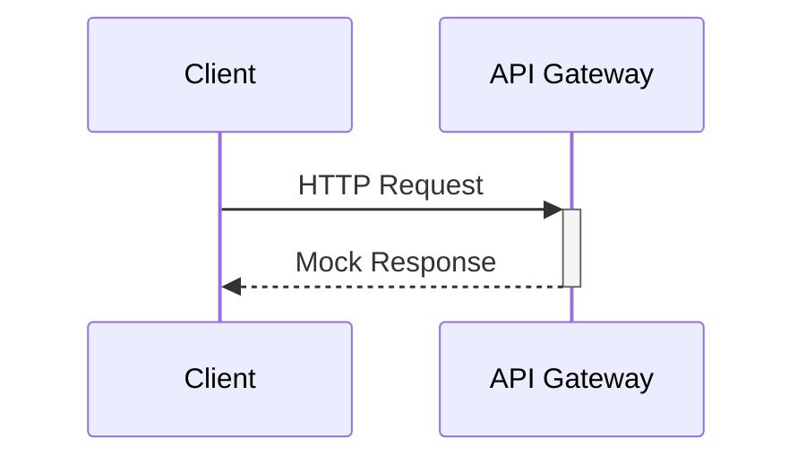
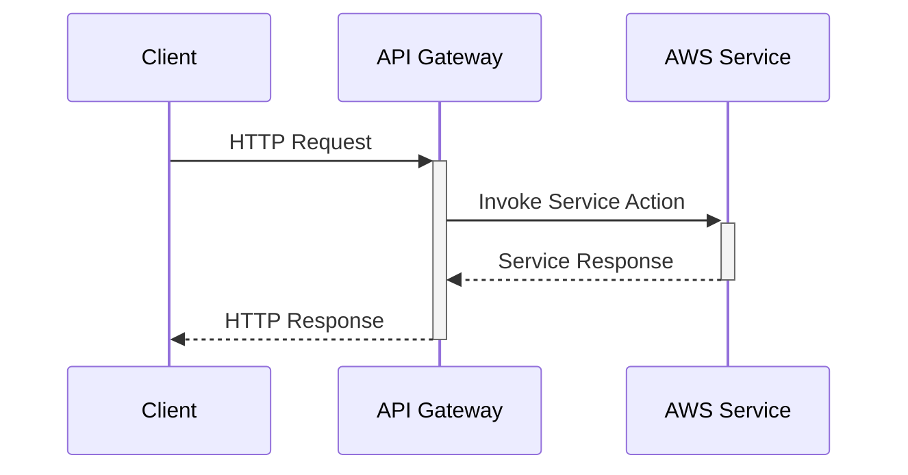
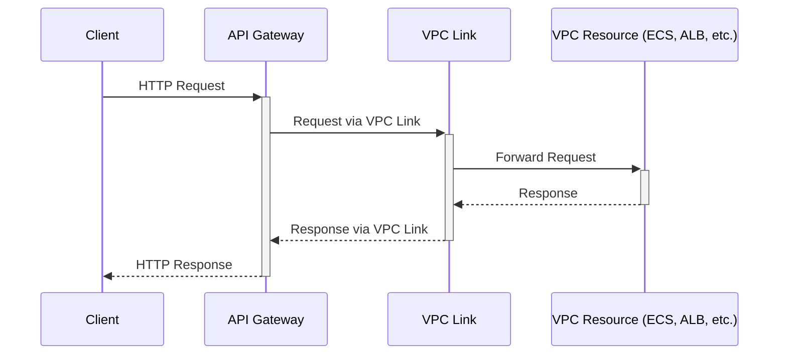

---

> This is my second article about `Amazon API Gateway`. You can find the other one here: [Amazon API Gateway exposed: choosing the right endpoint strategy for your API](/posts/amazon-api-gateway-exposed/).
>
> These articles are not intended to serve as an introduction to Amazon API Gateway.
{: .prompt-info }

## 1. Introduction

Beyond the commonly known Lambda Function integration, API Gateway offers the option to connect with AWS services, HTTP endpoints, and even private services securely in VPCs. This article aims to explore the various integration options available in Amazon API Gateway, covering:

- AWS Lambda Functions: The backbone of serverless APIs.
- HTTP Endpoints: Bridging your APIs with the world.
- Mock Responses: Simplifying development with simulated responses.
- AWS Services: Tightly integrating with the AWS ecosystem.
- Private Services through VPC Links: Securely connecting to internal resources.

The integration types available for each type of API Gateway are:

- REST API & REST API Private:
  - 
- HTTP API:
  - 
- WebSocket API:
  - 

## 2. Lambda Function Integration

Connecting AWS Lambda functions to Amazon API Gateway is a highlight of serverless computing, offering unparalleled scalability and flexibility. This powerful synergy enables developers to deploy serverless applications that dynamically scale to meet user demand, freeing them from the conventional challenges of server maintenance.

API Gateway can trigger Lambda functions in response to HTTP requests, serving as a highly adaptable interface for any application or backend service. This integration is pivotal for running code in a serverless environment, where operational management and scalability concerns are abstracted away.

### 2.1. Lambda Integration options

Lambda integrations come in two flavors, each catering to different needs:

- `Proxy Integration`: Acts as a **straightforward pass-through** to the Lambda function, passing every detail of the HTTP request (headers, body, query parameters). This method is ideal for rapid API setup, requiring minimal configuration while providing maximum flexibility.
- `Non-Proxy Integration`: Offers **granular control over the request and response flow** between API Gateway and Lambda. By utilizing Velocity Template Language (VTL), developers can tailor the request transformation before it reaches Lambda and likewise adjust the response before it's returned to the client. This approach suits cases where specific request/response formats must be adhered to.

### 2.2 Key Advantages

- `Scalability`: Automatically scales with incoming request volume, ensuring performance remains consistent.
- `Cost-Effectiveness`: Charges are solely based on the number of requests and the execution time, excluding the cost of the integration itself.
- `Ease of Integration`: Simplifies the process of connecting your API to Lambda functions, streamlining deployment.

### 2.3. Visual representation



This diagram succinctly illustrates the request-response cycle facilitated by Lambda integration, highlighting the efficiency and simplicity of this approach.

### 2.4. Performance and security

- `Performance`: Benefits from AWS Lambda's inherent auto-scaling capabilities, offering **high performance**.
- `Security`: Governed by IAM roles and policies, ensuring robust access control and data protection.

### 2.5. Cost Implications

While there's no direct charge for integrating Lambda with API Gateway, costs are incurred `based on request volume and the duration of Lambda function execution`, following AWS Lambda pricing models.

### 2.6. Practical Applications

- `Data Processing`: Ideal for applications requiring real-time data analysis or manipulation.
- `Real-Time Processing`: Supports interactive applications by providing immediate backend responses.
- `Serverless Backend Services`: Enables the development of fully serverless architectures for backend services, from web applications to data APIs.

> **Implementation example**
>
> Consider a scenario where you need to process incoming order data in XML format, but your Lambda function expects JSON. Using a `non-proxy integration`, you can configure API Gateway to transform the XML into JSON before it reaches the Lambda function. Conversely, if the Lambda function returns JSON, you can set API Gateway to convert this JSON back into XML for the client.
{: .prompt-info }

### 2.7. Configuration Code Sample (Terraform)

Below is a simplified example using Terraform to demonstrate setting up a proxy integration with AWS Lambda:

```terraform
resource "aws_api_gateway_rest_api" "MyApi" {
  name        = "LambdaProxyApi"
}

resource "aws_api_gateway_resource" "MyResource" {
  rest_api_id = aws_api_gateway_rest_api.MyApi.id
  parent_id   = aws_api_gateway_rest_api.MyApi.root_resource_id
  path_part   = "{proxy+}"
}

resource "aws_api_gateway_method" "MyLambdaIntegration" {
  rest_api_id   = aws_api_gateway_rest_api.MyApi.id
  resource_id   = aws_api_gateway_resource.MyResource.id
  http_method   = "POST"
  authorization = "NONE"
  integration {
    type              = "AWS_PROXY"
    http_method       = "POST"
    uri               = "arn:aws:apigateway:${var.region}:lambda:path/2015-03-31/functions/${var.lambda_function_arn}/invocations"
    integration_http_method = "POST"
  }
}
```

This Terraform script sets up an API Gateway with a proxy integration to an AWS Lambda function, illustrating how effortlessly these components can be linked to harness the power of serverless computing.

## 3. HTTP Integrations

HTTP integrations enable API Gateway to `act as a proxy for HTTP endpoints`. This includes integration with HTTP-enabled AWS services, external HTTP APIs, and microservices. This flexibility makes HTTP integrations a cornerstone for extending the functionality of your applications beyond the AWS ecosystem.

API Gateway can act as a **robust intermediary**, forwarding requests from clients to any HTTP endpoint and then returning the response to the client. This capability is especially valuable for integrating with RESTful APIs across the internet or within your AWS environment, enabling seamless interaction with a wide array of services.

### 3.1. Key Advantages

- `Flexibility`: Connect to any HTTP endpoint, AWS-hosted or externally hosted.
- `Efficiency`: Reduces latency by directly integrating your API with HTTP-supported applications or services.
- `Generic HTTP Proxy`: Uses standard HTTP methods and integrates with services that may not have native API Gateway integrations.

### 3.2. Visual representation



This diagram illustrates the process flow, highlighting how API Gateway serves as an intermediary between clients and HTTP services.

### 3.3. Performance and security

- `Performance`: It depends on the targeted HTTP endpoint, underscoring the importance of choosing responsive services for integration.
- `Security`: Use HTTPS to secure data in transit.

### 3.4. Cost Implications

Integrating with HTTP endpoints incurs no additional fees beyond API Gateway's standard request pricing. Note, however, that `data transfer` costs and any charges associated with the external service apply, making it essential to monitor usage to manage expenses effectively.

### 3.5. Practical Applications

HTTP integrations are versatile, supporting a wide range of applications:

- `Third-party API Integration`: Ideal for incorporating functionality from external services, such as social media feeds, payment processing, or weather data.
- `Microservices Architecture`: Facilitates a decoupled architecture by allowing individual microservices, possibly hosted on ECS or EC2, to communicate through API Gateway.
- `Content Delivery and Management`: Streamlines content distribution and management by serving as a gateway to content hosted across different platforms.

> **Implementation example**
>
> Suppose you want to integrate your API Gateway with a third-party weather service API to fetch weather updates. This service provides an HTTP endpoint that accepts GET requests with a city name as a query parameter and returns weather data in JSON format.
{: .prompt-info }

### 3.6. Configuration Code Sample (Terraform)

Below is a simplified Terraform script demonstrating how to configure HTTP proxy integration, illustrating the ease with which API Gateway can connect to external services:

```terraform
resource "aws_api_gateway_rest_api" "MyApi" {
  name = "HttpProxyApi"
}

resource "aws_api_gateway_resource" "MyResource" {
  rest_api_id = aws_api_gateway_rest_api.MyApi.id
  parent_id   = aws_api_gateway_rest_api.MyApi.root_resource_id
  path_part   = "weather"
}

resource "aws_api_gateway_method" "MyHttpIntegration" {
  rest_api_id   = aws_api_gateway_rest_api.MyApi.id
  resource_id   = aws_api_gateway_resource.MyResource.id
  http_method   = "GET"
  authorization = "NONE"

  integration {
    type                    = "HTTP_PROXY"
    integration_http_method = "GET"
    uri                     = "https://example.com/weather"
  }
}
```

This example underscores the straightforward nature of setting up HTTP integrations, empowering developers to rapidly extend their APIs' capabilities.

## 4. Mock Integrations

Mock integrations allow you to `simulate API behavior without backend integration`. With mock integrations, you can return a fixed response to the API caller directly from API Gateway, facilitating the validation of API definitions and client-side development independent of the backend.

### 4.1. Key Advantages

Mock integrations serve multiple purposes, significantly reducing the time and resources typically required for API development:

- `Fast Prototyping`: Quickly mock API responses for client development without the need for a backend.
- `Testing and Validation`: Simplify the process of testing API contracts and response structures, ensuring that API consumers can handle various response types effectively.

### 4.2. Visual representation



### 4.3. Performance and security

- `Performance`: Delivers immediate responses, bypassing the latency and processing time associated with backend services.
- `Security`: Leverages API Gateway's built-in security features, ensuring that mock endpoints are protected according to the same standards as any other API endpoint.

### 4.4. Cost Implications

Mock integrations are cost-effective, incurring charges `only based on the number of API calls made`, without additional fees for the mock functionality itself. This makes it an economical choice for developing, testing, and iterating on APIs.

### 4.5. Practical Applications

Mock integrations are particularly useful in scenarios such as:

- `API Prototyping and Testing`: Developers can quickly create mock endpoints to test API interactions, client handling of various response types, and error conditions without waiting for backend implementation.
- `Static Data Responses`: Ideal for scenarios where an API needs to return consistent, predictable data for frontend development or testing purposes.
- `Error Simulation`: Facilitates the testing of client applications' resilience and error handling by simulating API failures or unexpected responses.

> **Implementation example**
>
> Imagine you're working on a new application feature that requires specific API responses for frontend logic testing. By setting up a mock integration, you can configure API Gateway to return a predetermined JSON response, such as a 200 status code with {"message": "This is a mock response"}, enabling the frontend team to advance without backend dependencies.
{: .prompt-info }

### 4.6. Configuration Code Sample (Terraform)

Below is a Terraform example that demonstrates configuring a mock integration, showcasing the simplicity of setting up mocked responses:

```terraform
resource "aws_api_gateway_rest_api" "MyApi" {
  name = "MockApi"
}

resource "aws_api_gateway_resource" "MyResource" {
  rest_api_id = aws_api_gateway_rest_api.MyApi.id
  parent_id   = aws_api_gateway_rest_api.MyApi.root_resource_id
  path_part   = "mockpath"
}

resource "aws_api_gateway_method" "MyMockIntegration" {
  rest_api_id   = aws_api_gateway_rest_api.MyApi.id
  resource_id   = aws_api_gateway_resource.MyResource.id
  http_method   = "GET"
  authorization = "NONE"

  integration {
    type = "MOCK"
    request_templates = {
      "application/json" = "Action=MockResponse&{ \"statusCode\": 200 }"
    }
    integration_responses = [{
      status_code = "200"
      response_templates = {
        "application/json" = "{\"message\": \"This is a mock response\"}"
      }
    }]
  }
}
```

This script exemplifies how to establish a mock integration within API Gateway using Terraform, enabling developers to simulate API endpoints swiftly.

## 5. AWS Service Integrations

AWS Service integrations allow API Gateway to `interact directly with other AWS services without writing custom integration code`. This integration simplifies architecture by enabling direct access to AWS services, such as putting an item into an Amazon DynamoDB table or publishing a message to an Amazon SNS topic, directly through API Gateway.

### 5.1. Key Advantages

The direct connection to AWS services through API Gateway not only simplifies the architecture but also enhances the overall efficiency and scalability of your applications:

- Simplicity: Eliminates the need for intermediary services or layers, allowing for a cleaner architecture.
- Direct access: Enable APIs to perform actions directly on AWS services.

> Difference between `AWS Services` integration and `HTTP` integration:
>
> AWS Service Integrations are a subset of what you can achieve with HTTP Integrations, but they offer a more integrated, AWS-centric approach, simplifying the configuration by abstracting the underlying HTTP requests into AWS SDK-like actions directly within API Gateway.
{: .prompt-tip }

### 5.2. Visual representation



This diagram exemplifies how API Gateway acts as a conduit between clients and AWS services, streamlining the request and response flow.

### 5.3. Performance and security

- `Performance`: AWS Service Integrations are built on the robust AWS infrastructure, ensuring high availability and reliability.
- `Security`: Leveraging AWS Identity and Access Management (IAM) roles and permissions, these integrations offer fine-grained security controls, ensuring that only authorized entities can execute specific actions.

### 5.4. Cost Implications

Similar to HTTP integrations, the cost is based on the API Gateway's request pricing. Additionally, standard operation charges for the integrated AWS service apply.

### 5.5. Practical Applications

The versatility of AWS Service Integrations supports a broad spectrum of use cases:

- `Direct Database Interaction`: Streamline data storage and retrieval by interacting directly with DynamoDB.
- `Notifications and Messaging`: Utilize SNS or SQS for efficient message broadcasting and queueing.
- `Workflow Orchestration`: Leverage AWS Step Functions for complex workflow execution directly from API Gateway.

> **Implementation example**
>
> Imagine a scenario where you need real-time data from a DynamoDB table accessible via your API. Setting up an AWS Service Integration allows API Gateway to directly query DynamoDB, bypassing the need for a Lambda function. This direct approach reduces latency, simplifies the architecture, and can lower costs.
{: .prompt-info }

### 5.6. Configuration Code Sample (Terraform)

Below is an enhanced Terraform script that outlines configuring AWS Service Integration for DynamoDB:

```terraform
resource "aws_api_gateway_rest_api" "MyApi" {
  name = "DynamoDBServiceApi"
}

resource "aws_api_gateway_resource" "MyResource" {
  rest_api_id = aws_api_gateway_rest_api.MyApi.id
  parent_id   = aws_api_gateway_rest_api.MyApi.root_resource_id
  path_part   = "data"
}

resource "aws_api_gateway_method" "MyDynamoDBIntegration" {
  rest_api_id   = aws_api_gateway_rest_api.MyApi.id
  resource_id   = aws_api_gateway_resource.MyResource.id
  http_method   = "POST"
  authorization = "NONE"

  integration {
    type                    = "AWS"
    integration_http_method = "POST"
    uri                     = "arn:aws:apigateway:${var.region}:dynamodb:action/PutItem"
    credentials             = aws_iam_role.apigateway_dynamodb.arn
  }
}
 ```

This script demonstrates how to set up an API Gateway method that directly interacts with DynamoDB, showcasing the efficiency and simplicity of AWS Service Integrations.

### 5.7. AWS Console example

In this case, I will show you how to configure the direct integration between Amazon API Gateway and DynamoDB and Step Functions.

The `method execution` visual flow is common for both cases:


I will show you only the key configuration for each option, and you will understand how it works.

#### 5.7.1. Direct integration with Step Functions

This is the `integration request`. Important values here are:

- AWS Service: Step Functions
- HTTP method: POST
- Action name: StartExecution
- Execution Role: you have to create one role for API Gateway with permissions to connect to Step Functions


This part is optional, but if you don't configure it here, you have to specify in each request the ARN of the Step Functions you want to connect with:


#### 5.7.2. Direct integration with DynamoDB

This is the `integration request`. Important values here are:

- AWS Service: DynamoDB
- HTTP method: POST
- Action name: Scan
- Execution Role: you have to create one role for API Gateway with permissions to connect to Step Functions


> It's important to define the HTTP method as POST. However, your API Gateway method can be a GET method.
{: .prompt-tip }

This part is optional, but if you don't configure it here, you have to specify in each request the ARN of the Step Functions you want to connect with:


## 6. VPC Link Integrations

VPC Link integrations enable `private integrations` that allow API Gateway to securely connect with resources within an Amazon Virtual Private Cloud (VPC). This is particularly useful for accessing HTTP endpoints hosted within your VPC, without exposing them to the public internet.

### 6.1. Types of VPC Links

When setting up a VPC Link, it's important to distinguish between the two types available in API Gateway:

- `REST API VPC Link`: Only supports integration with an NLB (Network Load Balancer).
- `HTTP API VPC Link`: Supports integration with both ALB (Application Load Balancer) and NLB.

### 6.2. Key Advantages

By leveraging VPC Links, you can maintain the security posture of your back-end systems while ensuring seamless connectivity from API Gateway:

- `Security`: Safeguards back-end systems by avoiding public internet exposure, relying instead on the inherent security features of AWS VPC.
- `Private Access`: Facilitates direct access to VPC-contained resources, such as microservices or databases, from your APIs, enhancing internal communication security and efficiency.

### 6.3. Visual representation



This illustration demonstrates the flow of requests and responses facilitated by VPC Links, highlighting the secure, internal pathway within the VPC.

### 6.4. Performance and security

- `Performance`: The effectiveness of VPC Link integrations largely hinges on your VPC's network setup and the performance of the targeted back-end services.
- `Security`: VPC Links bolster the security of API integrations by ensuring that traffic between API Gateway and VPC resources does not traverse the public internet, utilizing AWS's robust VPC security mechanisms.

### 6.5. Cost Implications

Pricing includes an `hourly charge for each VPC link, plus data processed charges`. This is in addition to the API Gateway's standard request pricing.

### 6.6. Practical Applications

Employing VPC Link is particularly advantageous for:

- `Securing Private Microservices`: Ideal for architectures where microservices deployed on Amazon ECS or EKS within a VPC need to be securely exposed via API Gateway without public internet access.

> **Implementation example**
>
> If you have a microservice running on Amazon ECS that's exposed via an Application Load Balancer (ALB) within your VPC, you can use VPC Link to create a secure connection between the API Gateway and the ALB. This setup allows `HTTP API Gateway` to route requests to your ECS service without exposing the service to the public internet. To achieve this, create a VPC Link in the API Gateway pointing to your ALB, and then configure your API's integration request to route through the VPC Link.
{: .prompt-info }

### 6.7. Configuration Code Sample (Terraform)

Here's an enhanced Terraform script that provides a blueprint for setting up a VPC Link integration to connect an HTTP API Gateway with an Application Load Balancer with fixed response:

> 22/02/2025: Updated the terraform code to show the full example
{: .prompt-info }

This is the evidence that the following code works:


```terraform
variable "availability_zones" {
  description = "List of availability zones"
  type        = list(string)
  default     = ["eu-west-1a", "eu-west-1b"]
}

# API Gateway VPC Link
resource "aws_apigatewayv2_vpc_link" "MyVPCLink" {
  name              = "MyVPCLink"
  security_group_ids = [aws_security_group.my_sg.id]
  subnet_ids        = aws_subnet.my_subnet[*].id
}

# ALB Setup for Microservices (e.g., ECS)
resource "aws_lb" "my_alb" {
  name               = "my-alb"
  internal           = true
  load_balancer_type = "application"
  security_groups    = [aws_security_group.my_sg.id]
  subnets            = aws_subnet.my_subnet[*].id
}

# ALB Listener for HTTP traffic
resource "aws_lb_listener" "my_alb_listener" {
  load_balancer_arn = aws_lb.my_alb.arn
  port              = 80
  protocol          = "HTTP"

  default_action {
    type = "fixed-response"
    fixed_response {
      status_code = 200
      message_body = "API Gateway connected to ALB"
      content_type = "text/plain"
    }
  }
}

# Security Group for ALB
resource "aws_security_group" "my_sg" {
  name        = "my-security-group"
  description = "Security group for ALB"
  vpc_id      = aws_vpc.my_vpc.id

  # Allow incoming HTTP traffic from the VPC (API Gateway VPC Link)
  ingress {
    from_port   = 80
    to_port     = 80
    protocol    = "tcp"
    cidr_blocks = ["10.0.0.0/16"]  # Allow traffic from within the VPC
  }

  # Allow all outbound traffic
  egress {
    from_port   = 0
    to_port     = 0
    protocol    = "-1"
    cidr_blocks = ["0.0.0.0/0"]
  }
}

# VPC Configuration
resource "aws_vpc" "my_vpc" {
  cidr_block = "10.0.0.0/16"
}

# Subnets Setup
resource "aws_subnet" "my_subnet" {
  count                   = 2
  vpc_id                  = aws_vpc.my_vpc.id
  cidr_block              = count.index == 0 ? "10.0.1.0/24" : "10.0.2.0/24"
  availability_zone       = var.availability_zones[count.index]
  map_public_ip_on_launch = false
}

# Define API Gateway (HTTP API)
resource "aws_apigatewayv2_api" "my_api" {
  name          = "MyAPIGatewayAPI"
  protocol_type = "HTTP"
}

resource "aws_apigatewayv2_integration" "my_integration" {
  api_id           = aws_apigatewayv2_api.my_api.id
  integration_type = "HTTP_PROXY"
  integration_uri  = aws_lb_listener.my_alb_listener.arn  # Use ALB Listener ARN here
  connection_type  = "VPC_LINK"
  connection_id    = aws_apigatewayv2_vpc_link.MyVPCLink.id
  integration_method = "ANY"
}

# Define Route for the API Gateway with the specified HTTP method
resource "aws_apigatewayv2_route" "my_route" {
  api_id    = aws_apigatewayv2_api.my_api.id
  route_key = "ANY /myendpoint"  # Define HTTP method and API path here
  target    = "integrations/${aws_apigatewayv2_integration.my_integration.id}"
}

resource "aws_apigatewayv2_stage" "my_stage" {
  api_id      = aws_apigatewayv2_api.my_api.id
  name        = "test"
  auto_deploy = true    # Automatically deploy changes
}
```

This Terraform configuration outlines the creation of a VPC Link in HTTP API Gateway, targeting an Application Load Balancer (ALB) within a VPC, demonstrating the straightforward process of securing your API's access to internal services.

## 7. Conclusion

Throughout this article, we have explored the various integration options available in Amazon API Gateway, each serving distinct purposes and offering unique advantages. From the serverless prowess of **Lambda Function integrations** to the robust connectivity of **HTTP and AWS Service integrations**, as well as the secure, **private connections** facilitated by VPC Links and the simplicity of **Mock Responses** for development and testing, API Gateway stands as a versatile tool in the AWS ecosystem. Below is a summary table that recaps these integration types, their benefits, use cases, and cost considerations:

| Integration Type       | Key Advantages                                         | Use Cases                                | Cost Implications                                       |
|------------------------|--------------------------------------------------------|------------------------------------------|---------------------------------------------------------|
| Lambda Function        | Scalability, Cost-Effectiveness, Ease of Integration   | Data Processing, Real-Time Processing    | Based on request volume and Lambda function execution   |
| HTTP                   | Flexibility, Efficiency, Generic HTTP Proxy            | Third-party APIs, Microservices          | API Gateway request pricing plus external service costs |
| Mock                   | Fast Prototyping, Testing and Validation               | API Prototyping, Testing, Static Data    | Based on API call volume                                |
| AWS Service            | Simplicity, Direct access                              | Database Interaction, Notifications     | API Gateway request pricing plus AWS service operation charges |
| VPC Link               | Security, Private Access                               | Securing Private Microservices           | Hourly charge for each VPC link plus data processed     |

This table underscores the flexibility and power of API Gateway, illustrating how it can serve a wide range of applications and architectural needs. By carefully selecting the appropriate integration type, developers can optimize their backend services for performance, cost, and security, ensuring their applications are scalable, efficient, and well-integrated within the AWS landscape.

Incorporating these integrations into your architecture not only enhances the capabilities of your applications but also aligns with best practices for cloud-native development, leveraging the full potential of AWS services to create robust, scalable, and secure applications.
