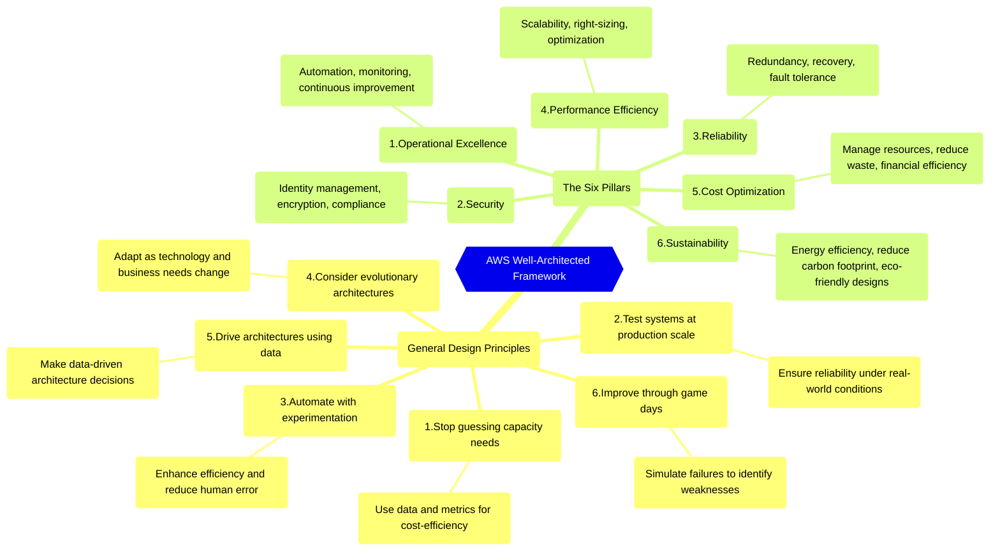

---

> This is the **first article** in a series about the `AWS Well-Architected Framework`.
>
> More articles in the series:
>
> - 2/5 - [How to apply the Well-Architected Framework depending on your cloud role](/posts/how-to-apply-the-well-architected-framework-depending-on-your-cloud-role/).
> - 3/5 - [Deep Dive of the Six Pillars](/posts/the-six-pillars-of-aws-well-architected-framework-best-practices-for-cloud-success/).
> - 4/5 - [Quick Wins for Each Pillar](/posts/immediate-impact-quick-wins-for-each-pillar-of-the-aws-well-architected-framework/).
> - 5/5 - [AWS Well-Architected Tool](/posts/how-the-aws-well-architected-tool-can-transform-your-cloud-architecture/).
{: .prompt-info }

---

## 1. Introduction

When you're working with cloud architecture, it's easy to get lost among services, resources, and technical decisions. But... how do you know if you're really doing it right? That's where the `AWS Well-Architected Framework` comes in.

> I've been using it with different teams and clients for a while. And I'm more convinced every time: **it's a gold mine, and we should use it more often**.
{: .prompt-tip }

The Framework is a practical guide to help you **review, improve, and evolve** your cloud architectures continuously.

> It's not about doing it perfectly. It's about doing it better each time.
{: .prompt-warning }

---

## 2. Why is this Framework important?

Here’s why it’s (really) worth applying the Framework:

1. AWS created it to help you **identify what a good cloud architecture looks like**.
2. It’s **based on best practices**, not only from AWS, but applicable to any cloud environment.
3. It guides you toward an architecture that is `secure`, `efficient`, `resilient`, `scalable`, `cost-optimized`, and more `sustainable`.
4. It helps you **detect risks** before they turn into problems.

Want more?

### 2.1. Benefits for you as a cloud professional

1. `Become a cloud expert`: Learn and solidify the best practices of cloud architecture.
2. `Think like AWS`: Improve your skills by applying well-established principles in real environments.
3. `Gain strategic vision`: Make more informed decisions and back them up with solid reasoning.

> This information is invaluable for cloud professionals.
{: .prompt-tip }

### 2.2. Benefits for Your Cloud Architecture

1. **Align with Best Practices**: Ensure your architecture aligns with modern cloud standards.
2. **Encourage Iterative Progress**: Promote a culture of continuous improvement, allowing your cloud environment to adapt to new challenges and opportunities with ease.
3. **Improve Security and Compliance**: Build a secure foundation that meets industry regulations.
4. **Maximize Performance and Scalability**: Optimize your resources for efficiency while building systems that seamlessly scale with growing demand.
5. **Reduce Costs**: Apply principles that help you manage resources effectively.
6. **Enhance Sustainability**: Integrate practices that minimize environmental impact and support corporate responsibility.

---

## 3. Understanding the AWS Well-Architected Framework

> This is your path to Cloud Excellence.
{: .prompt-info }

### 3.1. What it is

The `AWS Well-Architected Framework` is a set of **design principles, best practices, and questions** provided by AWS to help build and operate secure, high-performing, resilient, and efficient systems.

At its core, `it's a guide for making informed decisions` about the architecture of your applications and workloads on AWS, helping you reduce risks, optimize costs, and improve reliability and performance.

### 3.2. Purpose

To help build better cloud systems through continuous assessment and the application of AWS best practices.

### 3.3. The Framework in theory

> The concepts behind it.
{: .prompt-info }

#### 3.3.1. General Design Principles

These principles form the `foundation of cloud architecture and provide general guidance` that applies to any workload, regardless of specific needs. They are not tied to a particular AWS service or use case, making them universally applicable across cloud environments.

1. **Stop guessing your capacity needs**: Use data and metrics to determine the right capacity, ensuring flexibility and cost-efficiency.
2. **Test systems at production scale**: Build environments that mirror production to ensure reliability under real-world conditions.
3. **Automate with architectural experimentation in mind**: Leverage automation to enhance efficiency and reduce human error across your infrastructure.
4. **Consider evolutionary architectures**: Enable systems to evolve as technology and business requirements change.
5. **Drive architectures using data**: Make architecture decisions based on concrete data rather than assumptions.
6. **Improve through game days**: Simulate failure scenarios to stress-test your architecture and identify weaknesses for improvement.

#### 3.3.2. The Six Pillars

The Six Pillars represent the `core areas` that guide your focus when building well-architected cloud solutions. Each pillar comes with specific design principles and best practices to help you optimize your workload.

1. **Operational Excellence**: Focuses on `automation`, `monitoring`, and `continuous improvement` to ensure operational efficiency.
2. **Security**: Encompasses `identity management`, `encryption`, and `compliance` measures to protect your data and workloads.
3. **Reliability**: Ensures `redundancy`, `recovery`, and `fault tolerance` so that your systems remain functional under failure conditions.
4. **Performance Efficiency**: Prioritizes `scalability`, `right-sizing`, and `optimization` to ensure resources are used effectively as demand changes.
5. **Cost Optimization**: Focuses on `managing resources`, `reducing waste`, and `improving financial efficiency` to maximize cloud investments.
6. **Sustainability**: Aims to enhance `energy efficiency`, `reduce carbon footprint`, and design `eco-friendly architectures` that align with corporate responsibility goals.

I will explain these pillars with more detail in the next article of the series (each pillar has its own set of design principles and best practices).

> The General Design Principles set the foundation for your cloud architecture, while the Six Pillars focus on building specific aspects of your strategy.
{: .prompt-info }

### 3.4. Applying the Framework to real architectures

> Moving from theory to action.
{: .prompt-info }

Beyond the concepts, the Framework also provides tools and mechanisms to apply it to real-world architectures:

- `Key questions by pillar`: Help you assess your workloads systematically.
- `AWS Well-Architected Tool`: A free tool in the AWS console to review your architectures, identify risks, and track improvements.
- `Well-Architected Reviews`: Structured evaluations you can do yourself or with support.

> The goal isn’t to have a perfect architecture, but to improve it continuously.
{: .prompt-tip }

### 3.5. Visualizing the concepts

---

## 4. Conclusion

> The Framework doesn’t just help you build right from the beginning. It also guides you to continuously improve, detect what’s not working… and fix it in time.
{: .prompt-info }

It’s not just a set of guidelines—it's a **powerful tool that can help you design and manage cloud workloads** that are secure, reliable, efficient, and cost-effective.

This `mindmap` diagram, also available online [here](https://whimsical.com/aws-well-architected-framework-v1-0-LMSYMqmRpZSzV1Y8cARNH8){:target="_blank"}, provides a visual summary of the key concepts discussed in this article.

In the next article we'll explore `How to apply the Well-Architected Framework depending on your cloud role`. [Access here](/posts/how-to-apply-the-well-architected-framework-depending-on-your-cloud-role/).

<!-- For further reading, explore AWS's comprehensive resources:

- [AWS Well-Architected Framework](https://docs.aws.amazon.com/wellarchitected/latest/framework/welcome.html){:target="_blank"}
- [Well-Architected Labs](https://www.wellarchitectedlabs.com/){:target="_blank"}
- [Online map tool](https://wa.aws.amazon.com/wat.map.en.html){:target="_blank"} -->
