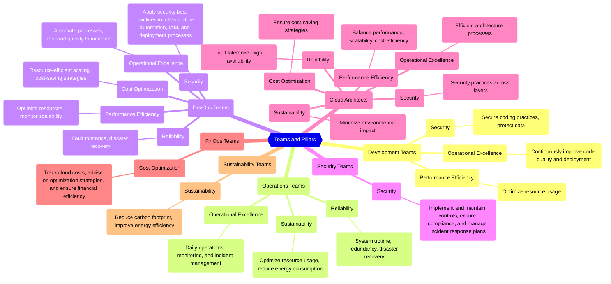
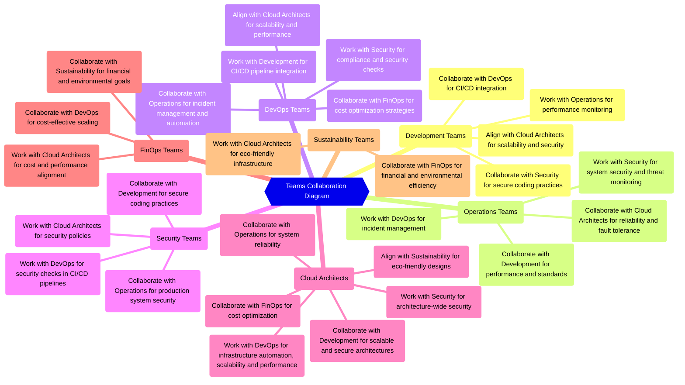

---

> This is the **second article** in a series about the `AWS Well-Architected Framework`.
>
> More articles in the series:
>
> - 1/5 - [Why the AWS Well-Architected Framework really matters](/posts/why-the-aws-well-architected-framework-really-matters/).
> - 3/5 - [Deep Dive of the Six Pillars](/posts/the-six-pillars-of-aws-well-architected-framework-best-practices-for-cloud-success/).
> - 4/5 - [Quick Wins for Each Pillar](/posts/immediate-impact-quick-wins-for-each-pillar-of-the-aws-well-architected-framework/).
> - 5/5 - [AWS Well-Architected Tool](/posts/how-the-aws-well-architected-tool-can-transform-your-cloud-architecture/).
{: .prompt-info }

---

## 1. Introduction

This article explores `how the AWS Well-Architected Framework translates into concrete actions for different roles` within a cloud team. Because while all pillars are important, not every team needs to focus on the same ones.

Are you a developer? Do you work in operations? Are you in charge of security? Are you an architect or part of the DevOps team? This article will help you identify which pillars are most relevant to you, with real-world examples and practical advice.

---

## 2. Aligning AWS Pillars with Your Role: Who Should Focus on What?

The AWS Well-Architected Framework **applies to everyone working on cloud systems**. However, not all pillars carry the same weight for every role.

In this section, I analyze how each type of team (development, operations, security, DevOps, cloud architecture, and FinOps) can align their responsibilities with the pillars that are most important for their day-to-day work.

> Other roles such as business or product can also be considered, which, although not addressed here, also contribute to the pillars from other perspectives.
>
> - Business: They decide roadmap, budget, vision
> - Product: They prioritize functionalities and user experience
{: .prompt-warning }

The goal is to provide a practical guide: which pillars each team prioritizes, concrete examples, and how they collaborate with each other to build well-designed cloud solutions.

### 2.1. Development Teams

Development teams turn ideas into cloud-ready applications by writing secure, efficient, and scalable code.

- **Pillars**:
  - **Operational Excellence**: Continuously improve code quality and deployment processes.
    > *Example: Follow best practices for error handling, logging, and automated testing to ensure resilient, maintainable applications and smooth deployments.*
  - **Security**: Implement secure coding practices and protect data at the application level.
    > *Use AWS Systems Manager Parameter Store or AWS Secrets Manager to securely store API keys and credentials, depending on org policies.*
  - **Performance Efficiency**: Optimize application performance, select scalable architecture patterns, and right-size compute resources.
    > *Example: Use Amazon RDS Proxy to reduce database connection overhead and improve performance in high-volume workloads.*

- **Collaboration**:
  - with `Operations` teams to ensure logs and metrics are correctly monitored.
  - with `Security` to integrate secure coding and compliance early in the development lifecycle.
  - with `DevOps` to ensure that CI/CD pipelines are automated and reliable.
  - with `Cloud Architects` to ensure that architecture choices support scalability, security, and fault tolerance.

### 2.2. Operations Teams

Operations teams keep the cloud environment stable, efficient, and aligned with business needs by managing daily operations and solving operational challenges.

- **Pillars**:
  - **Operational Excellence**: Focus on daily operations, monitoring, and incident management.
    > *Example: Set up CloudWatch alarms for CPU or memory thresholds to detect issues early and reduce downtime.*
  - **Reliability**: Maintain system uptime, redundancy, and disaster recovery.
    > *Example: Use AWS Auto Scaling and monitor infrastructure health to maintain availability under varying loads.*
  - **Sustainability**: Manage resource utilization and reduce energy consumption during operations.
    > *Example: Use CloudWatch to identify and right-size underutilized instances, lowering cost and energy impact.*

- **Collaboration**:
  - with `Development` to meet performance and reliability goals.
  - with `Security` to ensure secure and compliant production environments.
  - with `DevOps` to streamline incident response and deployments.
  - with `Cloud Architects` to evolve the architecture toward long-term reliability.

### 2.3. Security Teams

Security teams protect data and applications from threats by implementing strong security controls and ensuring regulatory compliance.

- **Pillars**:
  - **Security**: Lead the effort in implementing and maintaining controls, ensuring compliance with industry standards, and managing incident response plans.
    > *Example: Leverage AWS Security Hub for centralized security alerts and AWS Identity and Access Management (IAM) policies to enforce least privilege organization-wide.*

- **Collaboration**:
  - with `Development` to integrate secure coding practices and data protection early in development.
  - with `Operations` to ensure security monitoring is active across production environments.
  - with `DevOps` to integrate security checks and compliance requirements into the CI/CD pipeline.
  - with `Cloud Architects` to implement security policies that cover all layers of the architecture.

### 2.4. DevOps Teams

`DevOps` teams (along with `SRE` roles) automate deployments, manage incidents, and ensure applications are scalable, reliable, and secure.

- **Pillars**:
  - **Operational Excellence**: Automate deployments, testing, and monitoring.
    > *Example: Use CodePipeline with CodeBuild to continuously run tests and deploy changes.*
  - **Security**: Apply controls in CI/CD and secure infrastructure as code.
    > *Example: Integrate security validations before deployment and IAM policies in pipelines.*
  - **Reliability**: Implement backups, fault tolerance, and disaster recovery.
    > *Example: Configure AWS Backup with automatic policies and environment-based restoration.*
  - **Performance Efficiency**: Automatically scale resources and optimize costs.
    > *Example: Use Auto Scaling to adjust capacity.*
  - **Cost Optimization**: Implement cost-saving strategies.
    > *Example: Use AWS Savings Plans to optimize costs.*

- **Collaboration**:
  - `Development`: To seamlessly integrate code changes.
  - `Operations`: To deploy and intervene automatically.
  - `Security`: To apply controls throughout the lifecycle.
  - `Cloud Architects`: To align automation with scalability and resilience.
  - `FinOps`: To balance automatic scaling with cost optimization.

### 2.5. Cloud Architects

`Cloud architects` design strategic, scalable, and secure solutions aligned with business objectives. This role combines responsibilities of both `cloud architects` (technical implementation) and `solutions architects` (business alignment).

> *Note: This role connects all teams. They ensure that all six pillars of the Well-Architected Framework are present in every technical and organizational decision.*
{: .prompt-info }

- **Pillars**:
  - **Operational Excellence**: Lead automation and consistent design across the entire infrastructure.
    > *Example: Use IaC for repeatable and auditable deployments.*
  - **Security**: Define security policies and standards at the architectural level.
    > *Example: Configure Security Hub to monitor compliance and detect vulnerabilities.*
  - **Reliability**: Design systems with high availability, fault tolerance, and recovery.
    > *Example: Use Load Balancers with health checks to direct traffic only to healthy instances.*
  - **Performance Efficiency**: Efficiently scale systems and avoid bottlenecks.
    > *Example: Use Amazon ECS with Fargate to automatically scale without managing servers.*
  - **Cost Optimization**: Adjust the design to balance performance, availability, and cost.
    > *Example: Analyze with Cost Explorer and migrate to more cost-effective services like Lambda or Graviton.*
  - **Sustainability**: Drive decisions that reduce unnecessary resource usage.
    > *Example: Prioritize serverless architectures to minimize the carbon footprint.*

- **Collaboration**:
  - `Development`: To ensure secure and scalable applications aligned with the defined architecture.
  - `Operations`: To guarantee system reliability and that architectural updates are correctly implemented in production.
  - `Security`: To ensure that security best practices are applied at all layers of the architecture.
  - `DevOps`: To align infrastructure automation with the overall architectural vision.
  - `FinOps`: To evaluate the impact of design decisions on costs and apply savings recommendations without compromising technical requirements.
  - `Sustainability`: To include environmental criteria in architectural decisions from the design phase.

### 2.6. FinOps Teams

`FinOps` teams maximize cloud value by optimizing costs without compromising performance or availability.

- **Pillars**:
  - **Cost Optimization**: Monitor spending, detect deviations, and advise on cost-saving strategies.
    > *Example: Use AWS Budgets and Cost Anomaly Detection to identify unusual patterns and prevent overspending.*

- **Collaboration**:
  - with `DevOps` to ensure that cost optimization strategies are aligned with infrastructure automation and scaling.
  - with `Cloud Architects` to ensure cost-saving strategies align with performance and availability requirements.
  - with `Sustainability` teams to ensure financial and environmental goals are integrated.

### 2.7. Sustainability Teams

`Sustainability` teams help reduce the environmental impact of the cloud through more efficient and responsible decisions.

> This is the least clear and utilized role of all those mentioned in the article, but it should become increasingly important, which is why I've given it a place here.
{: .prompt-info }

- **Pillars**:
  - **Sustainability**: Lead the effort to align cloud usage with environmental goals.
    > *Example: Use the AWS Carbon Footprint Tool to identify improvements in energy efficiency.*

- **Collaboration**:
  - `Cloud Architects`: To include environmental criteria in infrastructure design.
  - `FinOps`: To balance sustainability and financial efficiency.

## 3. Visualizing Role-Pillar Relations and Team Collaboration

### 3.1. Summary Table

| Role/Team      | Main Pillars                                                 | Brief Comment                                                                      | Key Collaborations                                                                    |
|-----------------|--------------------------------------------------------------|------------------------------------------------------------------------------------|--------------------------------------------------------------------------------------|
| Development     | Operational Excellence, Security, Performance Efficiency     | Secure, efficient, and maintainable code; focus on best practices and scalability. | Operations, Security, DevOps, Architecture                                        |
| Operations      | Operational Excellence, Reliability, Sustainability          | Monitoring, resilience, and efficient resource utilization.                        | Development, Security, DevOps, Architecture                                         |
| Security        | Security                                                     | Defines controls, compliance, and threat management.                               | Development, Operations, DevOps, Architecture                                       |
| DevOps          | Operational Excellence, Security, Reliability, Performance Efficiency, Cost Optimization | CI/CD automation, scaling, efficiency, and security throughout the lifecycle.     | Development, Operations, Security, Architecture, FinOps                            |
| Architecture    | All Pillars                                                  | Global vision: technical decisions aligned with business and sustainability.         | Development, Operations, Security, DevOps, FinOps, Sustainability                  |
| FinOps          | Cost Optimization, Sustainability                            | Cloud spending control with a focus on financial and environmental efficiency.     | DevOps, Architecture, Sustainability                                                |
| Sustainability  | Sustainability                                                | Reduces environmental impact and promotes efficient resource usage.                | Architecture, FinOps                                                                 |

### 3.2. Relationship between roles and the pillars

### 3.3. Collaboration between teams

---

## 4. Conclusion

Applying the AWS Well-Architected Framework is not the responsibility of a single person or team. Each role has a different responsibility, and when everyone works aligned with the appropriate pillars, the results are clear: more robust, secure, efficient, and sustainable architectures.

This mind map diagram, also available online [here](https://whimsical.com/aws-well-architected-framework-v1-1-roles-Cwp3RncSXvdBEYiJeEmt6i){:target="_blank"}, visually summarizes the key concepts we've covered in this article:

In the next article of this series, we'll dive into each of the six pillars of the Framework, exploring their principles, best practices, and how to apply them in real-world scenarios. [Access here](/posts/the-six-pillars-of-aws-well-architected-framework-best-practices-for-cloud-success/).

<!-- For further reading, explore AWS's comprehensive resources:

- [AWS Well-Architected Framework](https://docs.aws.amazon.com/wellarchitected/latest/framework/welcome.html){:target="_blank"}
- [Well-Architected Labs](https://www.wellarchitectedlabs.com/){:target="_blank"}
- [Online map tool](https://wa.aws.amazon.com/wat.map.en.html){:target="_blank"} -->
