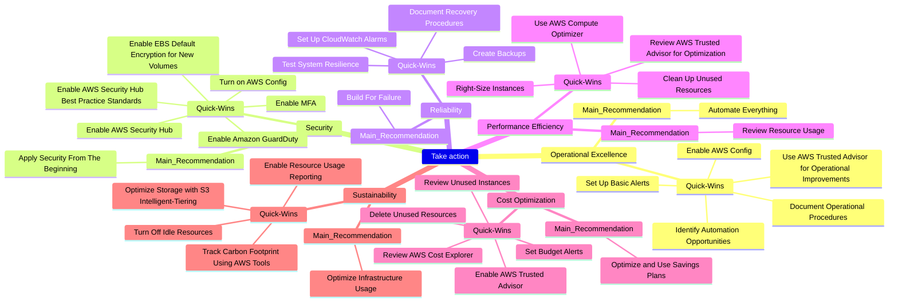

---

---

## 1. What is a Quick Win and its Relationship to the Framework

*Quick Wins* are those **fast and simple actions you can take today to achieve immediate improvements** in your AWS architecture.

For teams starting with the AWS Well-Architected Framework, Quick Wins are crucial. They provide tangible results without the need for a complete restructuring, allowing for agile optimization of performance, security, and costs, and laying the groundwork for broader architectural initiatives.

> Addressing *Quick Wins* at the beginning allows teams to demonstrate value and facilitate the justification of deeper strategies in the future.
{: .prompt-tip }

---

## 2. Take action: Quick-Wins per Pillar

> More Actionable Insights
{: .prompt-info }

Now that we've explored the Six Pillars in detail, here are some actionable insights you can start applying today.

`Quick wins` are essential for teams looking to get started with the AWS Well-Architected Framework because they `offer immediate, actionable improvements` without requiring a complete revision of your cloud environment. These `small but impactful changes` allow teams to improve performance, security, and cost efficiency quickly, helping build momentum toward longer-term architectural goals. By tackling quick wins first, teams can realize tangible benefits and demonstrate progress, making it easier to justify and implement more comprehensive strategies afterward.

### 2.1 Take action: Operational Excellence

> **Main Recommendation**: Automate everything you can to minimize human error and improve operational efficiency.
{: .prompt-tip }

- **Quick-Wins**:
  - **Document operational procedures**: Create a shared document for key processes.
  - Regularly review your operational procedures and **identify opportunities to automate for improved efficiency and time savings**.
  - **Set up basic alerts**: Use AWS CloudWatch to create basic monitoring alerts for critical services.
  - **Enable AWS Config**: Quickly enable AWS Config to track configuration changes and improve auditing.
  - **Use AWS Trusted Advisor** to identify operational improvements.

- **Other important recommendations**:
  - Continuously improve your operational procedures through frequent review and feedback.
  - Focus on building a culture of accountability and continuous improvement.

### 2.2 Take action: Security

> **Main Recommendation**: Apply security from the beginning and in all layers.
{: .prompt-tip }

- **Quick-Wins**:
  - **Enable AWS Security Hub**: Activate AWS Security Hub to get a centralized view of your security alerts and compliance status.
  - **Enable AWS Security Hub best practice standards**: Quickly configure built-in best practice standards in Security Hub to assess compliance and detect potential security gaps.
  - **Enable Amazon GuardDuty**: Turn on Amazon GuardDuty for threat detection and monitoring unauthorized activities in real-time.
  - **Enable MFA**: Implement multi-factor authentication across all AWS accounts.
  - **Turn on AWS Config**: Use AWS Config rules to continuously evaluate the compliance of your AWS resources.
  - **Enable EBS default encryption** for new volumes.

- **Other important recommendations**:
  - Build a layered security approach that includes identity management, encryption, and network protection.
  - Regularly assess and audit your security posture with automated compliance checks.

### 2.3 Take action: Reliability

> **Main Recommendation**: Build for failure; assume services will fail and design for graceful recovery.
{: .prompt-tip }

- **Quick-Wins**:
  - **Set up CloudWatch alarms**: Create alarms for critical resource metrics (CPU, memory) to detect issues early.
  - **Create backups**: Centralize and automate backups across your services using AWS Backup.
  - **Document recovery procedures**: Quickly outline recovery steps for your key services in case of an incident.
  - **Test system resilience**: Use AWS Fault Injection Simulator to conduct quick fault injection tests, such as simulating a service failure or network disruption.

- **Other important recommendations**:
  - Ensure redundancy and fault tolerance at all levels of your architecture.
  - Implement proactive monitoring and automated recovery for key services.

### 2.4 Take action: Performance Efficiency

> **Main Recommendation**: Continuously review your resource usage to ensure you're not over-provisioned.
{: .prompt-tip }

- **Quick-Wins**:
  - **Use AWS Compute Optimizer**: Activate Compute Optimizer to receive recommendations for right-sizing your instances and other resources.
  - **Right-Size Instances**: Use AWS Trusted Advisor to review and adjust EC2 instance sizes for optimal performance and cost.
  - **Clean up unused resources**: Identify and terminate unused EC2 instances, EBS volumes, and other resources to improve efficiency.

- **Other important recommendations**:
  - Regularly optimize and scale resources to meet demand efficiently.
  - Leverage serverless or managed services to minimize infrastructure management and focus on performance.

### 2.5 Take action: Cost Optimization

> **Main Recommendation**: Always optimize by rightsizing and using savings plans wherever possible.
{: .prompt-tip }

- **Quick-Wins**:
  - **Enable AWS Trusted Advisor**: Turn on Trusted Advisor to receive insights on cost-saving opportunities across your AWS services.
  - **Set budget alerts**: Use AWS Budgets to create cost thresholds and receive alerts if you're exceeding your budget.
  - **Review AWS Cost Explorer**: Analyze your AWS costs and usage patterns in the Cost Explorer dashboard for better financial efficiency.
  - **Delete unused resources**: Regularly review and terminate any unused or underutilized resources to minimize costs.
  - Review and terminate unused or underutilized instances.

- **Other important recommendations**:
  - Regularly assess your workloads for cost-saving opportunities, using tools like Cost Explorer and Trusted Advisor.
  - Adopt a consumption model that encourages resource efficiency and financial sustainability.

### 2.6 Take action: Sustainability

> **Main Recommendation**: Optimize infrastructure usage by embracing serverless and managed services for sustainability.
{: .prompt-tip }

- **Quick-Wins**:
  - **Turn Off Idle Resources**: Automate shutdown of non-critical resources outside business hours.
  - **Optimize storage**: Review your S3 buckets and enable S3 Intelligent-Tiering to optimize storage costs based on access patterns.
  - **Enable resource usage reporting**: Set up reporting to track and optimize resource usage for environmental sustainability.
  - Leverage AWS managed services to benefit from AWS's energy-efficient infrastructure.
  - Minimize data transfer costs by keeping workloads and resources within the same region.
  - Track your AWS carbon footprint with the AWS Customer Carbon Footprint Tool.

- **Other important recommendations**:
  - Reduce your carbon footprint by optimizing resource usage and using energy-efficient services.
  - Automate resource management to minimize environmental impact and reduce operational costs.

### 2.7. Visualizing the Quick-Wins

---

## 3. Conclusion

The quick wins provided here offer a `great starting point` for applying AWS Well-Architected best practices in manageable steps. By making small, targeted improvements, you can rapidly enhance the efficiency, security, and reliability of your cloud environment. These quick wins are especially valuable as you continue to refine and evolve your architecture.

However, `implementing quick wins is just the beginning`. To fully optimize your workloads and ensure you're following best practices across all pillars, `a more comprehensive review is necessary`. This is where the `AWS Well-Architected Tool` comes into play. In the next article, we'll guide you through using the AWS Well-Architected Tool, which provides a structured way to assess your workloads, identify weaknesses, and implement long-term improvements.

> Remember, the AWS Well-Architected Framework is designed for continuous improvement, so `start small and iterate frequently`. Implementing these quick wins is just the first step on your path to building robust, secure, and efficient cloud architectures.
{: .prompt-warning }

Do you want more? Here is the next and last article of the series: [AWS Well-Architected Tool](/posts/how-the-aws-well-architected-tool-can-transform-your-cloud-architecture/).

<!-- For further reading, explore AWS's comprehensive resources:

- [AWS Well-Architected Framework](https://docs.aws.amazon.com/wellarchitected/latest/framework/welcome.html){:target="_blank"}
- [Well-Architected Labs](https://www.wellarchitectedlabs.com/){:target="_blank"}
- [Online map tool](https://wa.aws.amazon.com/wat.map.en.html){:target="_blank"} -->
