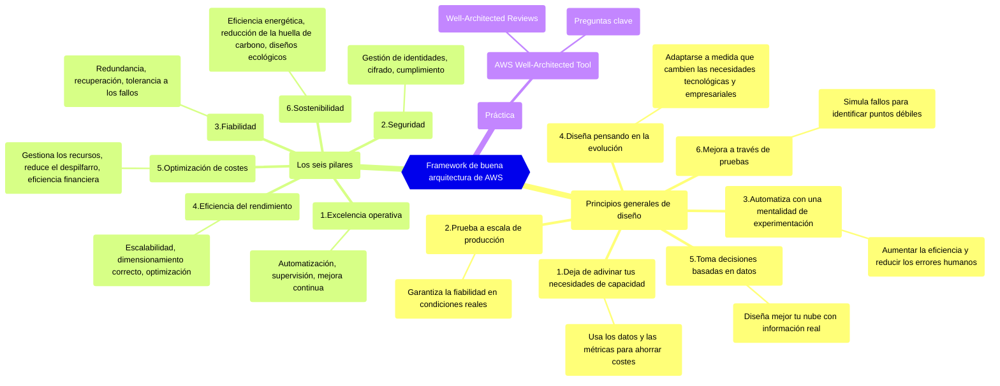

---

> Este es el **primer artículo** de una serie sobre el `AWS Well-Architected Framework`, o en español, el marco de las **buenas prácticas de arquitectura de AWS**.
>
> Los otros artículos de la serie son:
>
> - 2/5 - [Cómo aplicar el Well-Architected Framework según tu rol](/es/posts/how-to-apply-the-well-architected-framework-depending-on-your-cloud-role/).
> - 3/5 - [Desglosando los Seis Pilares del AWS Well-Architected Framework](/es/posts/the-six-pillars-of-aws-well-architected-framework-best-practices-for-cloud-success/).
> - 4/5 - [Quick-wins para cada Pilar](/es/posts/immediate-impact-quick-wins-for-each-pillar-of-the-aws-well-architected-framework/): Descubre qué cambios puedes hacer en cada pilar para obtener resultados inmediatos y sin esfuerzo.
> - 5/5 - [AWS Well-Architected Tool](/es/posts/how-the-aws-well-architected-tool-can-transform-your-cloud-architecture/): una guía práctica sobre el uso de la Tool, para evaluar, mejorar y optimizar continuamente las cargas de trabajo.
{: .prompt-info }

En todos los artículos utilizaré los términos en inglés *AWS Well-Architected* y *AWS Well-Architected Framework*, porque en el ámbito profesional están más extendidos.

---

## 1. Introducción

Cuando trabajas con arquitectura cloud, es fácil perderte entre servicios, recursos y decisiones técnicas. Pero... ¿cómo saber si realmente lo estás haciendo bien? Ahí es donde entra el `AWS Well-Architected Framework`.

> Yo llevo tiempo usándolo con distintos equipos y clientes. Y cada vez lo tengo más claro: **es una mina de oro y deberíamos usarlo más**.
{: .prompt-tip }

El Framework es una guía práctica para ayudarte a **revisar, mejorar y hacer evolucionar** tus arquitecturas cloud de forma continua.

> No se trata de hacerlo perfecto. Se trata de hacerlo cada vez mejor.
{: .prompt-warning }

---

## 2. Por qué es importante este Framework

Aquí van las razones por las que (de verdad) merece la pena aplicar el Framework:

1. AWS lo ha creado para ayudarte a **identificar cómo es una buena arquitectura cloud**.
2. Está **basado en buenas prácticas**, no solo de AWS, sino aplicables a cualquier entorno cloud.
3. Te guía hacia una arquitectura `segura`, `eficiente`, `resiliente`, `escalable`, `optimizada en costes` y más `sostenible`.
4. Te permite **detectar riesgos** antes de que se conviertan en problemas.

¿Quieres más?

### 2.1. Beneficios para ti como profesional cloud

1. `Conviértete en un experto cloud`: Aprende y consolida las mejores prácticas de arquitectura cloud.
2. `Piensa como AWS`: Mejora tus habilidades aplicando principios bien establecidos en entornos reales.
3. `Gana visión estratégica`: Toma decisiones más informadas y justifica tus elecciones con fundamentos sólidos.

> Esta información tiene un valor incalculable para cualquier profesional cloud.
{: .prompt-info }

### 2.2. Beneficios para tus arquitecturas y cargas de trabajo

1. **Alineación con las mejores prácticas**: Asegúrate de que tus diseños cumplen las mejores prácticas cloud.
2. **Mejora continua**: Fomenta revisiones periódicas para adaptarte rápidamente a nuevos retos.
3. **Seguridad y cumplimiento**: Refuerza la seguridad y cumple con normativas como ISO, PCI-DSS o GDPR.
4. **Rendimiento y escalabilidad**: Ajusta los recursos para mejorar la eficiencia y soportar mayor demanda sin esfuerzo.
5. **Optimización de costes**: Reduce gastos innecesarios aplicando principios como rightsizing o apagado automático.
6. **Sostenibilidad**: Aplica decisiones conscientes que minimicen el impacto medioambiental y mejoren tu huella de carbono.

---

## 3. Entendiendo el AWS Well-Architected Framework

> Este es tu camino hacia la excelencia cloud.
{: .prompt-info }

### 3.1. Qué es

El `AWS Well-Architected Framework` es un conjunto de **principios de diseño, mejores prácticas y preguntas** que proporciona AWS para ayudar a construir y operar sistemas seguros, de alto rendimiento, resilientes y eficientes.

En esencia, `es una guía para tomar decisiones informadas` sobre la arquitectura de tus aplicaciones y cargas de trabajo en AWS, ayudándote a reducir riesgos, optimizar costes y mejorar la fiabilidad y el rendimiento.

### 3.2. Propósito

Ayudar a construir mejores sistemas cloud a través de una evaluación continua y la aplicación de las mejores prácticas de AWS.

### 3.3. El Framework en la teoría

> Los conceptos que lo sustentan.
{: .prompt-info }

El framework se estructura en dos componentes clave:

1. Principios generales de diseño
2. Los seis pilares

#### 3.3.1. Principios generales de diseño

Estos principios `forman la base de la arquitectura cloud y proporcionan una guía que aplica a cualquier carga de trabajo`, independientemente de las necesidades específicas. No están vinculados a ningún servicio o caso de uso de AWS en particular, por lo que son de aplicación universal en todos los entornos cloud.

1. **Deja de adivinar tus necesidades de capacidad**: Usa los datos y las métricas para determinar la capacidad correcta y garantizar la flexibilidad y la eficiencia en costes.
2. **Prueba en entornos iguales a producción** para garantizar la fiabilidad en condiciones reales.
3. **Automatiza con una mentalidad de experimentación** para crear y replicar tus cargas de trabajo a un bajo costo, evitando la inversión en esfuerzo manual.
4. **Diseña pensando en la evolución**: haz que los sistemas se adapten al cambio tecnológico y del negocio.
5. **Toma decisiones basadas en datos**.
6. **Mejora a través de pruebas**: simula escenarios de fallo para poner a prueba tu arquitectura e identificar los puntos débiles que se pueden mejorar.

#### 3.3.2. Los seis pilares

Los seis pilares representan las `principales áreas` a la hora de crear soluciones cloud con una buena arquitectura.

> Cada uno aborda una dimensión crítica de tu arquitectura. Juntos, forman una base sólida para cualquier carga de trabajo cloud.
{: .prompt-info }

1. **Excelencia operativa**: Se centra en la `automatización`, la `monitorización` y la `mejora continua` para garantizar la eficiencia operativa.
2. **Seguridad**: incluye medidas de `gestión de identidades`, `cifrado` y `cumplimiento` para proteger tus datos y cargas de trabajo.
3. **Fiabilidad**: garantiza la `redundancia`, la `recuperación` y la `tolerancia a fallos` para que tus sistemas sigan funcionando en condiciones de fallo.
4. **Eficiencia del rendimiento**: Prioriza la `escalabilidad`, el `dimensionamiento adecuado` y la `optimización` para garantizar que los recursos se utilizan de forma eficaz a medida que cambia la demanda.
5. **Optimización de costes**: se centra en `gestionar los recursos` y `mejorar la eficiencia financiera` para maximizar las inversiones cloud.
6. **Sostenibilidad**: Su objetivo es mejorar la `eficiencia energética`, `reducir la huella de carbono` y diseñar `arquitecturas sostenibles` que se ajusten a los objetivos de responsabilidad corporativa.

En el próximo artículo de esta serie, entraremos a fondo en cada uno de los pilares.

### 3.4. Aplicar el Framework en arquitecturas reales

> Pasar de la teoría a la acción.
{: .prompt-info }

Además de los conceptos, el framework también proporciona herramientas y mecanismos para aplicarlo en arquitecturas reales:

- `Preguntas clave por pilar`: Ayudan a evaluar tus cargas de trabajo de forma sistemática.
- `AWS Well-Architected Tool`: Herramienta gratuita desde la consola de AWS para revisar tus arquitecturas, identificar riesgos y registrar mejoras.
- `Well-Architected Reviews`: Evaluaciones estructuradas que puedes hacer tú mismo o con ayuda.

> El objetivo no es tener una arquitectura perfecta, sino mejorar continuamente.
{: .prompt-tip }

### 3.5. Visualizar los conceptos

---

## 4. Conclusión

> El framework no solo te ayuda a construir bien desde el principio. También te guía para mejorar continuamente, detectar lo que no está bien... y corregirlo a tiempo.
{: .prompt-info }

No es solo un conjunto de directrices, sino una **potente herramienta que puede ayudarte a diseñar y gestionar cargas de trabajo cloud** que sean seguras, fiables, eficientes y rentables.

Este diagrama de mapa mental, también accesible online [aquí](https://whimsical.com/aws-well-architected-framework-v1-0-LMSYMqmRpZSzV1Y8cARNH8){:target="_blank"} ofrece un resumen visual de los conceptos clave discutidos en este artículo.

En el siguiente artículo, exploraremos `Cómo aplicar el Well-Architected Framework según tu rol`. [Accede aquí](/es/posts/how-to-apply-the-well-architected-framework-depending-on-your-cloud-role/).

<!-- También puedes obtener más información en los siguientes recursos de AWS:

- [AWS Well-Architected Framework](https://docs.aws.amazon.com/wellarchitected/latest/framework/welcome.html){:target="_blank"}
- [Laboratorios del Well-Architected](https://www.wellarchitectedlabs.com/){:target="_blank"}
- [Herramienta de mapas en línea](https://wa.aws.amazon.com/wat.map.en.html){:target="_blank"} -->
