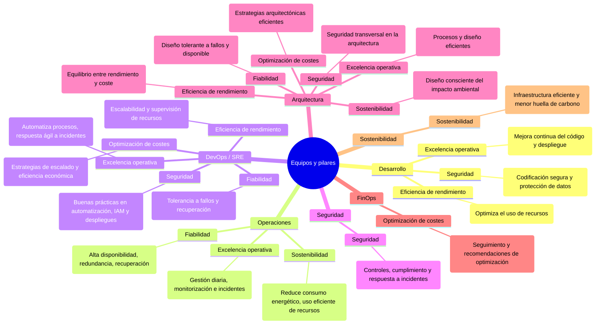
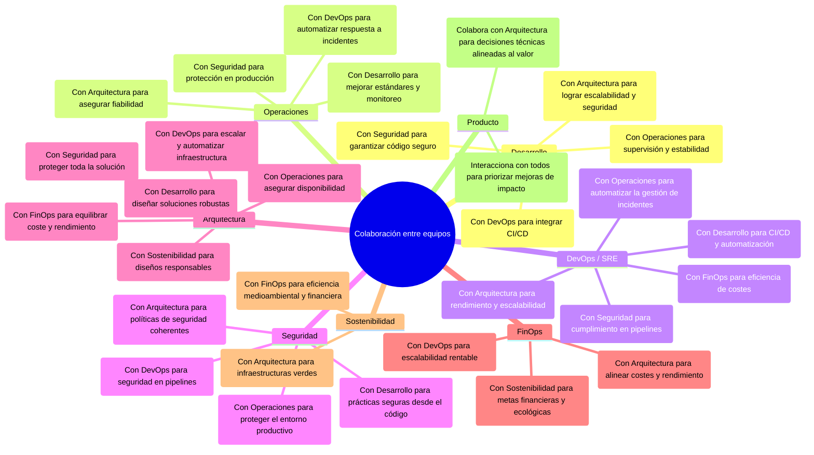

---

> Este es el **segundo artículo** de la serie sobre el `AWS Well-Architected Framework`, o en español, el marco de las **buenas prácticas de arquitectura de AWS**.
>
> Los otros artículos de la serie son:
>
> - 1/5 - [Por qué el AWS Well-Architected Framework importa (de verdad)](/es/posts/why-the-aws-well-architected-framework-really-matters/).
> - 3/5 - [Análisis en profundidad de los Seis Pilares del Framework](/es/posts/the-six-pillars-of-aws-well-architected-framework-best-practices-for-cloud-success/).
> - 4/5 - [Quick-wins para cada Pilar](/es/posts/immediate-impact-quick-wins-for-each-pillar-of-the-aws-well-architected-framework/): Descubre qué cambios puedes hacer en cada pilar para obtener resultados inmediatos y sin esfuerzo.
> - 5/5 - [AWS Well-Architected Tool](/es/posts/how-the-aws-well-architected-tool-can-transform-your-cloud-architecture/): una guía práctica sobre el uso de la Tool, para evaluar, mejorar y optimizar continuamente las cargas de trabajo.
{: .prompt-info }

En todos los artículos utilizaré los términos en inglés *AWS Well-Architected* y *AWS Well-Architected Framework*, porque en el ámbito profesional están más extendidos.

---

## 1. Introducción

Este artículo explora `cómo el AWS Well-Architected Framework se traduce en acciones concretas para distintos roles` dentro de un equipo cloud. Porque, aunque todos los pilares son importantes, no todos los equipos tienen que enfocarse en lo mismo.

¿Eres desarrollador? ¿Trabajas en operaciones? ¿Te encargas de la seguridad? ¿Eres arquitecto o parte del equipo DevOps? Este artículo te ayudará a ver qué pilares son más relevantes para ti, con ejemplos reales y consejos prácticos.

---

## 2. Alineando los pilares de AWS con tu rol: ¿quién debe centrarse en qué?

El AWS Well-Architected Framework **se aplica a todas las personas que trabajan en los sistemas cloud**. Pero no todos los pilares tienen el mismo peso para todos los roles.

En esta sección analizo cómo cada tipo de equipo (desarrollo, operaciones, seguridad, DevOps, arquitectura cloud y FinOps) puede alinear sus responsabilidades con los pilares más importantes para su día a día.

> También se pueden tener en cuenta otros roles como negocio o producto, que aunque no se aborden aquí, también contribuyen a los pilares desde otras perspectivas.
>
> - Negocio: Deciden roadmap, presupuesto, visión
> - Producto: Priorizan funcionalidades y experiencia de usuario
{: .prompt-warning }

El objetivo es dar una guía práctica: qué pilares prioriza cada equipo, ejemplos concretos y cómo colaboran entre ellos para construir soluciones cloud bien diseñadas.

### 2.1. Equipos de Desarrollo

Los equipos de `desarrollo` son los que convierten las ideas en aplicaciones cloud. Su foco está en escribir código seguro, eficiente y fácil de mantener.

- **Pilares**:
  - **Excelencia operativa**: mejora continuamente la calidad del código y los procesos de despliegue.
    > *Ejemplo: buenas prácticas en errores, logging y testeo automático para facilitar despliegues fiables.*
  - **Seguridad**: Implementa prácticas de codificación seguras y protege los datos a nivel de aplicación.
    > *Ejemplo: usar Parameter Store o Secrets Manager para gestionar credenciales de forma segura en tiempo de ejecución.*
  - **Eficiencia del rendimiento**: ajusta el uso de recursos, elige patrones escalables y busca el mejor rendimiento posible.
    > *Ejemplo: integrar RDS Proxy para reducir la sobrecarga de conexión en aplicaciones con alta concurrencia.*

- **Colaboración**:
  - `Operaciones`: para la integración de logs y métricas.
  - `Seguridad`: para aplicar prácticas seguras desde el código.
  - `DevOps`: para automatizar pipelines de CI/CD de forma fiables.
  - `Arquitectos Cloud`: para que las decisiones técnicas soporten escalabilidad, seguridad y resiliencia.

### 2.2. Equipos de Operaciones

Los equipos de `operaciones` se aseguran de que el entorno cloud sea estable, eficiente y alineado con las necesidades del negocio. Se encargan de las operaciones diarias, supervisan el rendimiento y resuelven desafíos operativos.

- **Pilares**:
  - **Excelencia operativa**: supervisa el entorno, gestiona incidentes y mantiene la operación diaria.  
    > *Ejemplo: configurar alarmas de CloudWatch para CPU o memoria permite detectar problemas de rendimiento y actuar antes de que afecten a la disponibilidad.*
  - **Fiabilidad**: garantiza la disponibilidad del sistema, su capacidad de recuperación y la redundancia.  
    > *Ejemplo: implementar escalado automático con AWS Auto Scaling para mantener la disponibilidad ante picos de carga.*
  - **Sostenibilidad**: optimiza el uso de recursos y reduce el consumo energético.  
    > *Ejemplo: detectar instancias infrautilizadas con CloudWatch y ajustarlas reduce costes y consumo energético.*

- **Colaboración**:
  - `Desarrollo`: para asegurar el rendimiento y la fiabilidad de las aplicaciones.
  - `Seguridad`: para cumplir políticas y detectar amenazas en producción.
  - `DevOps`: para una gestión fluida de incidentes y despliegues automatizados.
  - `Arquitectos Cloud`: para aplicar mejoras que aumenten la resiliencia del sistema.

### 2.3. Equipos de Seguridad

Los equipos de `seguridad` protegen los datos y las aplicaciones frente a amenazas. Definen controles sólidos y garantizan el cumplimiento de estándares y normativas.

- **Pilares**:
  - **Seguridad**: lideran la estrategia de protección, aplican controles de acceso, gestionan auditorías y planes de respuesta.  
    > *Ejemplo: usar AWS Security Hub para centralizar alertas y aplicar IAM con privilegios mínimos en toda la organización.*

- **Colaboración**:
  - `Desarrollo`: para integrar seguridad desde el código.
  - `Operaciones`: para supervisar amenazas en producción.
  - `DevOps`: para integrar requisitos de seguridad en CI/CD.
  - `Arquitectos Cloud`: para definir políticas globales seguras y escalables.

### 2.4. Equipos de DevOps

Los equipos de `DevOps` (junto con roles de `SRE`) automatizan los despliegues, gestionan los incidentes y garantizan que las aplicaciones sean escalables, fiables y seguras.

- **Pilares**:
  - **Excelencia operativa**: automatiza despliegues, pruebas y monitorización.  
    > *Ejemplo: usar CodePipeline con CodeBuild para ejecutar tests y desplegar cambios de forma continua.*
  - **Seguridad**: aplica controles en CI/CD y protege la infraestructura como código.  
    > *Ejemplo: integrar validaciones de seguridad antes del despliegue y políticas IAM en pipelines.*
  - **Fiabilidad**: implementa backups, tolerancia a fallos y recuperación ante desastres.  
    > *Ejemplo: configurar AWS Backup con políticas automáticas y restauración por entorno.*
  - **Eficiencia del rendimiento**: escala recursos automáticamente y optimiza costes.  
    > *Ejemplo: usar Auto Scaling para ajustar la capacidad.*
  - **Optimización de costes**: implementa estrategias de ahorro de costes.
    > *Ejemplo: usar AWS Savings Plans para optimizar costes.*

- **Colaboración**:
  - `Desarrollo`: para integrar cambios de código con fluidez.
  - `Operaciones`: para desplegar e intervenir de forma automatizada.
  - `Seguridad`: para aplicar controles en todo el ciclo de vida.
  - `Arquitectos Cloud`: para alinear automatización con escalabilidad y resiliencia.
  - `FinOps`: para equilibrar escalado automático con optimización de costes.

### 2.5. Arquitectos Cloud

Los `arquitectos cloud` diseñan soluciones estratégicas, escalables y seguras, alineadas con los objetivos empresariales. Este rol combina responsabilidades tanto de `arquitectos cloud` (implementación técnica) como de `arquitectos de soluciones` (alineación con negocio).

> *Nota: este rol conecta a todos los equipos. Se aseguran de que los seis pilares del Well-Architected Framework estén presentes en cada decisión técnica y organizativa.*
{: .prompt-info }

- **Pilares**:
  - **Excelencia operativa**: lideran la automatización y el diseño coherente de toda la infraestructura.  
    > *Ejemplo: uso de IaC para despliegues repetibles y auditables.*
  - **Seguridad**: definen las políticas y estándares de seguridad a nivel arquitectónico.  
    > *Ejemplo: configurar Security Hub para supervisar el cumplimiento y detectar vulnerabilidades.*
  - **Fiabilidad**: diseñan sistemas con alta disponibilidad, tolerancia a fallos y recuperación.  
    > *Ejemplo: usar Load Balancers con health checks para dirigir el tráfico solo a instancias sanas.*
  - **Eficiencia del rendimiento**: escalan los sistemas de forma eficiente y evitan cuellos de botella.  
    > *Ejemplo: usar Amazon ECS con Fargate para escalar automáticamente sin gestionar servidores.*
  - **Optimización de costes**: ajustan el diseño para equilibrar rendimiento, disponibilidad y coste.  
    > *Ejemplo: analizar con Cost Explorer y migrar a servicios más rentables como Lambda o Graviton.*
  - **Sostenibilidad**: impulsan decisiones que reducen el uso innecesario de recursos.  
    > *Ejemplo: priorizar arquitecturas serverless para minimizar la huella de carbono.*

- **Colaboración**:
  - `Desarrollo`: para asegurar aplicaciones seguras, escalables y alineadas con la arquitectura definida.
  - `Operaciones`: para garantizar la fiabilidad del sistema y que las actualizaciones de arquitectura se implementan correctamente en producción.
  - `Seguridad`: para asegurarse de que se aplican las mejores prácticas de seguridad en todas las capas de la arquitectura.
  - `DevOps`: para alinear la automatización de la infraestructura con la visión arquitectónica global.
  - `FinOps`: para evaluar el impacto de las decisiones de diseño en los costes y aplicar recomendaciones de ahorro sin comprometer los requisitos técnicos.
  - `Sostenibilidad`: para incluir criterios medioambientales en las decisiones arquitectónicas desde el diseño.

### 2.6. Equipos de FinOps

Los equipos de `FinOps` maximizan el valor cloud optimizando los costes sin comprometer el rendimiento ni la disponibilidad.

- **Pilares**:
  - **Optimización de costes**: monitorizan gastos, detectan desviaciones y asesoran sobre estrategias de ahorro.
    > *Ejemplo: usar AWS Budgets y Cost Anomaly Detection para detectar patrones inusuales y prevenir sobrecostes.*

- **Colaboración**:
  - `DevOps`: para alinear las optimizaciones con el escalado automático.
  - `Arquitectos Cloud`: para ajustar el diseño sin afectar la eficiencia o disponibilidad.
  - `Sostenibilidad`: para equilibrar las decisiones financieras con el impacto ambiental.

### 2.7. Equipos de Sostenibilidad

Los equipos de `sostenibilidad` ayudan a reducir el impacto ambiental de la nube mediante decisiones más eficientes y responsables.

> Este es el rol menos claro y utilizado de todos los mencionados en el artículo, pero debería ser cada vez más importante y por eso le he hecho un sitio aquí.
{: .prompt-info }

- **Pilares**:
  - **Sostenibilidad**: miden el impacto ambiental y promueven prácticas que reduzcan el consumo innecesario.
    > *Ejemplo: usar la herramienta de huella de carbono de AWS para identificar mejoras en eficiencia energética.*

- **Colaboración**:
  - `Arquitectos Cloud`: para incluir criterios medioambientales en el diseño de infraestructuras.
  - `FinOps`: para equilibrar sostenibilidad y eficiencia financiera.

## 3. Visualizar las relaciones entre los roles y los pilares

### 3.1. Tabla resumen

| Rol/Equipo     | Pilares principales                                          | Comentario breve                                                                 | Colaboraciones clave                                                                 |
|----------------|--------------------------------------------------------------|----------------------------------------------------------------------------------|---------------------------------------------------------------------------------------|
| Desarrollo     | Excelencia operativa, Seguridad, Eficiencia del rendimiento  | Código seguro, eficiente y mantenible; foco en buenas prácticas y escalabilidad.| Operaciones, Seguridad, DevOps, Arquitectura                                         |
| Operaciones    | Excelencia operativa, Fiabilidad, Sostenibilidad             | Monitorización, resiliencia y eficiencia en el uso de recursos.                 | Desarrollo, Seguridad, DevOps, Arquitectura                                          |
| Seguridad      | Seguridad                                                    | Define controles, cumplimiento y gestión de amenazas.                           | Desarrollo, Operaciones, DevOps, Arquitectura                                        |
| DevOps         | Excelencia operativa, Seguridad, Fiabilidad, Eficiencia del rendimiento, Optimización de costes | Automatización CI/CD, escalado, eficiencia y seguridad en todo el ciclo de vida.| Desarrollo, Operaciones, Seguridad, Arquitectura, FinOps                             |
| Arquitectura   | Todos los pilares                                            | Visión global: decisiones técnicas alineadas con negocio y sostenibilidad.      | Desarrollo, Operaciones, Seguridad, DevOps, FinOps, Sostenibilidad                   |
| FinOps         | Optimización de costes, Sostenibilidad                       | Control del gasto cloud con foco en eficiencia financiera y ambiental.          | DevOps, Arquitectura, Sostenibilidad                                                 |
| Sostenibilidad | Sostenibilidad                                               | Reduce el impacto ambiental y promueve el uso eficiente de recursos.            | Arquitectura, FinOps                                                                  |

### 3.2. Relación entre los roles y los pilares

### 3.3. Colaboración entre los equipos

---

## 4. Conclusión

Aplicar el AWS Well-Architected Framework no es tarea de una sola persona ni de un único equipo. Cada rol tiene una responsabilidad distinta y, cuando todos trabajan alineados con los pilares adecuados, los resultados se notan: arquitecturas más sólidas, seguras, eficientes y sostenibles.

Este diagrama en formato de `mapa mental`, también accesible online [aquí](https://whimsical.com/aws-well-architected-framework-v1-1-roles-Cwp3RncSXvdBEYiJeEmt6i){:target="_blank"}, resume visualmente los conceptos clave que hemos visto en este artículo:

En el siguiente artículo de esta serie entraremos en detalle sobre cada uno de los seis pilares del Framework, con sus principios, mejores prácticas y cómo aplicarlos en la práctica. [Accede aquí](/es/posts/the-six-pillars-of-aws-well-architected-framework-best-practices-for-cloud-success/).

<!-- Si quieres seguir profundizando, te recomiendo estos recursos oficiales de AWS:

- [AWS Well-Architected Framework](https://docs.aws.amazon.com/wellarchitected/latest/framework/welcome.html){:target="_blank"}
- [Laboratorios del Well-Architected](https://www.wellarchitectedlabs.com/){:target="_blank"}
- [Herramienta de mapas en línea](https://wa.aws.amazon.com/wat.map.en.html){:target="_blank"} -->
