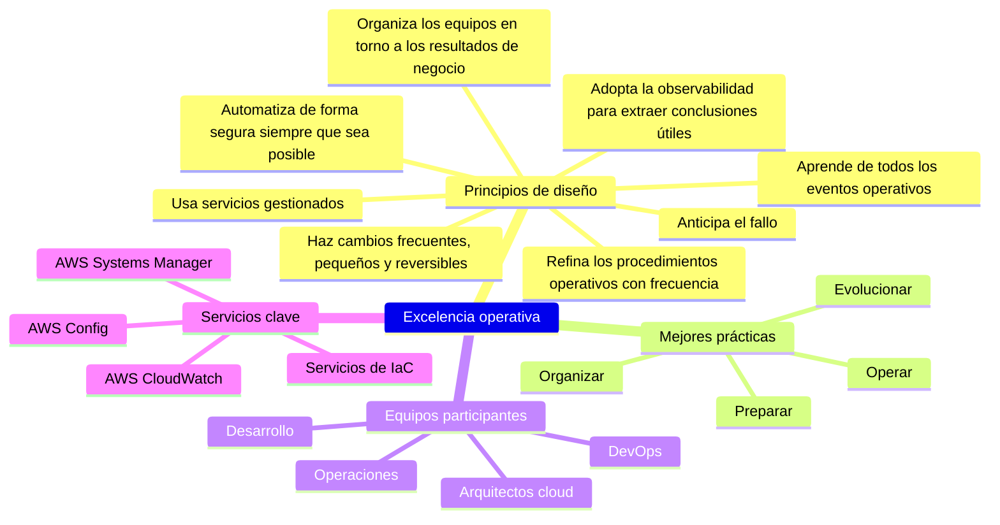
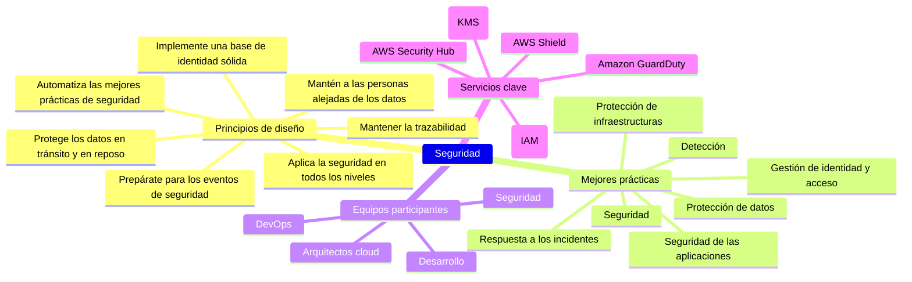
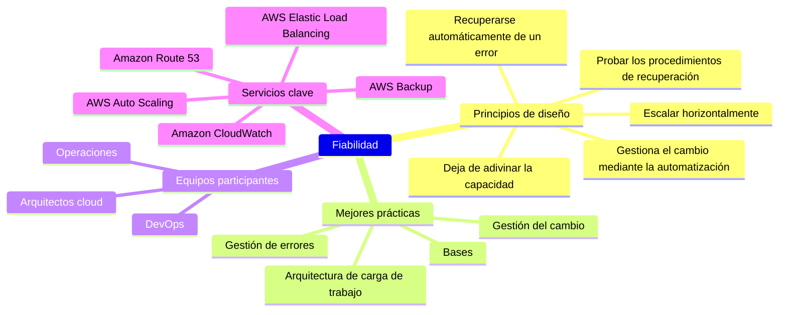
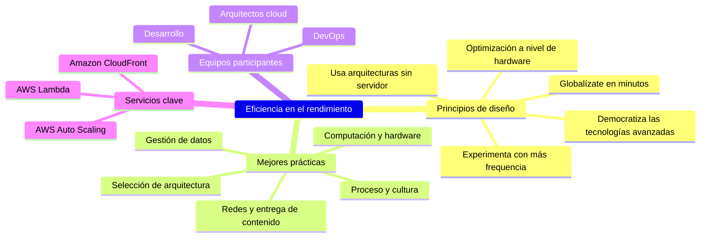
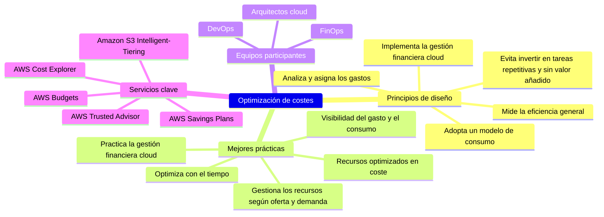
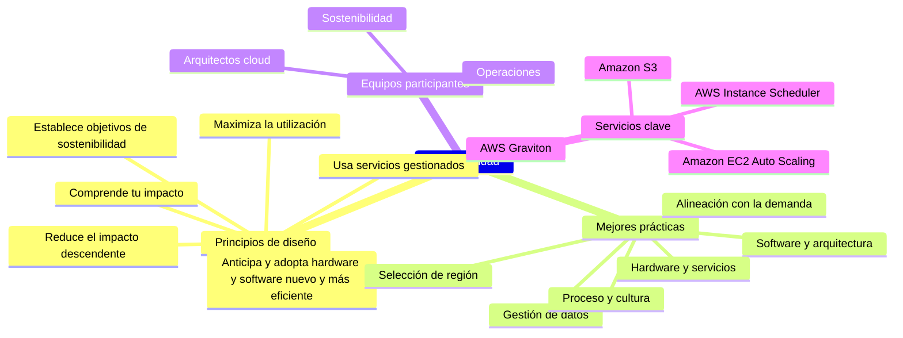

---

> Continuando con la serie, este es el **tercer artículo** de la serie sobre el `AWS Well-Architected Framework`, o en español, el marco de las **buenas prácticas de arquitectura de AWS**.
>
> Los otros artículos de la serie son:
>
> - 1/5 - [Por qué el AWS Well-Architected Framework importa (de verdad)](/es/posts/why-the-aws-well-architected-framework-really-matters/).
> - 2/5 - [Cómo aplicar el Well-Architected Framework según tu rol](/es/posts/how-to-apply-the-well-architected-framework-depending-on-your-cloud-role/).
> - 4/5 - [Quick-wins para cada Pilar](/es/posts/immediate-impact-quick-wins-for-each-pillar-of-the-aws-well-architected-framework/): Descubre qué cambios puedes hacer en cada pilar para obtener resultados inmediatos y sin esfuerzo.
> - 5/5 - [AWS Well-Architected Tool](/es/posts/how-the-aws-well-architected-tool-can-transform-your-cloud-architecture/): una guía práctica sobre el uso de la Tool, para evaluar, mejorar y optimizar continuamente las cargas de trabajo.
{: .prompt-info }

En todos los artículos utilizaré los términos en inglés *AWS Well-Architected* y *AWS Well-Architected Framework*, porque en el ámbito profesional están más extendidos.

---

## 1. Introducción

Construir una arquitectura cloud exitosa en AWS requiere más que solo elegir servicios.

El AWS Well-Architected Framewosk ofrece un camino probado, y en este tercer artículo de esta serie, te guiaré a través de sus seis pilares esenciales. Aprende las mejores prácticas que te permitirán diseñar, operar y optimizar tus cargas de trabajo para obtener el máximo rendimiento y eficiencia.

> Es una lectura imprescindible para cualquiera que quiera entender y mejorar su arquitectura cloud.
{: .prompt-tip }

## 2. Explorando los seis pilares

Los seis pilares son la base del AWS Well-Architected Framework y ofrecen una guía esencial para diseñar arquitecturas de nube que puedan adaptarse, escalar y funcionar de manera eficiente.

En esta sección, analizarás cada uno de los pilares, junto con sus principios clave de diseño y mejores prácticas. Este análisis en detalle te proporciona las herramientas para entender cómo optimizar tus cargas de trabajo cloud.

> Cada pilar ofrece un conjunto de principios de diseño y de mejores prácticas, y al revisarlos podrás detectar mejoras que puedes realizar en tus soluciones.
{: .prompt-warning }

> Para obtener la información más actualizada, consulta la documentación oficial de AWS [aquí](https://docs.aws.amazon.com/wellarchitected/latest/framework/the-pillars-of-the-framework.html){:target="_blank"}.

### 2.1. El pilar de la Excelencia Operativa

> Se centra en la `automatización`, la `supervisión` y la `mejora continua` para optimizar la eficiencia operativa.
{: .prompt-info }

- **Por qué es importante**:
  - La excelencia operativa **garantiza que tu infraestructura se adapte rápidamente a los cambios y funcione de manera eficiente**.
  - La automatización y la mejora continua ayudan a agilizar los procesos, reducir las intervenciones manuales y mejorar la prestación de servicios.
- **Ignorar este pilar puede**:
  - provocar tiempos de recuperación lentos, una mala gestión de los recursos y la pérdida de oportunidades de automatización, lo que aumenta los gastos operativos.

- **Principios de diseño** (8):
  - `Organiza los equipos en torno a los resultados de negocio`: garantiza la alineación entre el desarrollo y las operaciones para lograr una propiedad y una responsabilidad claras.
  - `Adopta la observabilidad para extraer conclusiones útiles`: utiliza logs, métricas y trazas para mejorar la visibilidad de la carga de trabajo.
  - `Automatiza de forma segura siempre que sea posible`: automatiza tareas como la aplicación de parches y el escalado para minimizar los errores humanos y acelerar las operaciones.
  - `Haz cambios frecuentes, pequeños y reversibles`: la entrega continua permite realizar ajustes rápidos y reduce el riesgo de fallos graves.
  - `Refina los procedimientos operativos con frecuencia`: los procesos evolucionan continuamente para adaptarse a los nuevos desafíos.
  - `Anticipa el fallo`: crea sistemas resilientes que asuma que los componentes fallarán y diséñalos para una recuperación rápida.
  - `Aprende de todos los eventos operativos`: realiza retrospectivas para mejorar los procesos tras los incidentes.
  - `Usa servicios gestionados`: reduce la carga operativa al aprovechar los servicios gestionados de AWS, que automatizan muchas tareas operativas.

- **Mejores prácticas** (4):
  - `Organizar`: establecer una propietario claro de los servicios y procesos.
  - `Preparar`: automatizar los preparativos para los eventos esperados e inesperados.
  - `Operar`: mejorar continuamente los procesos operativos, como la aplicación de parches y el escalado.
  - `Evolucionar`: refinar las operaciones en función de los comentarios y las lecciones aprendidas de incidentes anteriores.

- **Equipos participantes**:
  - `Desarrollo`: mejora continua de la calidad del código y los procesos de despliegue.
  - `Operaciones`: se centra en las operaciones diarias, la monitorización y la gestión de los incidentes.
  - `DevOps`: se enfoca en la automatización, la integración continua/entrega continua (CI/CD) y la monitorización.
  - `Arquitectos cloud`: supervisan toda la arquitectura y garantizan la excelencia operativa en todas las áreas.

- **Servicios clave**:
  - AWS CloudFormation, AWS CDK, AWS SAM: herramientas de infraestructura como código (IaC) para automatizar el aprovisionamiento y la gestión de los recursos.
  - AWS CloudWatch: monitoriza las métricas de rendimiento y configura las alarmas para el estado operativo.
  - AWS Config: rastrea los cambios de configuración y evalúa el cumplimiento.
  - AWS Systems Manager: automatiza las tareas operativas, como la gestión de parches y la configuración de los recursos.

- **Información adicional**:
  - Más información sobre el Pilar [aquí](https://docs.aws.amazon.com/wellarchitected/latest/operational-excellence-pillar/welcome.html){:target="_blank"}.
  - Laboratorios prácticos sobre este pilar [aquí](https://www.wellarchitectedlabs.com/operational-excellence/){:target="_blank"}.

### 2.2. Pilar de Seguridad

> Incluye medidas de `gestión de identidades`, `cifrado` y `cumplimiento` para proteger tus datos y cargas de trabajo.
{: .prompt-info }

- **Por qué es importante**:
  - La seguridad es fundamental para **proteger tus datos, aplicaciones y cargas de trabajo** del acceso no autorizado, garantizar el cumplimiento de la normativa y mitigar los riesgos.
  - Una postura de seguridad sólida no solo protege tus sistemas, sino que también genera confianza en los clientes.
- **Ignorar este pilar puede**:
  - hacerte correr el riesgo de filtraciones de datos, infracciones del cumplimiento y importantes daños financieros y reputacionales.

- **Principios de diseño** (7):
  - `Implementa una base de identidad sólida`: Usa el principio del mínimo privilegio para hacer cumplir los permisos.
  - `Mantener la trazabilidad`: asegúrate de que puedes hacer un seguimiento de todas las acciones mediante el registro y la auditoría.
  - `Aplica la seguridad en todos los niveles`: implementa controles de seguridad a nivel de red, aplicación y datos.
  - `Automatiza las mejores prácticas de seguridad`: utiliza la automatización para aplicar las configuraciones de seguridad y gestionar los recursos.
  - `Protege los datos en tránsito y en reposo`: cifra los datos para garantizar la confidencialidad.
  - `Mantén a las personas alejadas de los datos`: reduce o elimina la necesidad de acceso directo o procesamiento manual de los datos
  - `Prepárate para los eventos de seguridad`: Ten un plan para responder a los incidentes de seguridad y recuperarte de ellos.

- **Mejores prácticas** (7):
  - `Seguridad`: establece y aplica medidas de seguridad para proteger tus cargas de trabajo de las amenazas.
  - `Gestión de identidad y acceso`: gestiona quién puede acceder a los recursos y en qué condiciones.
  - `Detección`: Implementa el registro y la monitorización para detectar y responder a los incidentes de seguridad con rapidez.
  - `Protección de la infraestructura`: Asegura tu red y sistemas contra el acceso no autorizado.
  - `Protección de datos`: garantiza la privacidad e integridad de los datos mediante el cifrado y la gestión de claves.
  - `Respuesta a los incidentes`: desarrolla una estrategia de respuesta integral ante posibles brechas de seguridad.
  - `Seguridad de las aplicaciones`: Implementa controles de seguridad a nivel de aplicación para protegerte de las vulnerabilidades.

- **Equipos participantes**:
  - `Seguridad`: lidera la implementación y el mantenimiento de los controles, garantiza el cumplimiento de las normas del sector y gestiona los planes de respuesta a los incidentes.
  - `DevOps`: se centra en aplicar las mejores prácticas de seguridad en la automatización de infraestructuras, IAM y los procesos de despliegue.
  - `Desarrollo`: implementa prácticas de codificación seguras y protege los datos a nivel de aplicación.
  - `Arquitectos cloud`: se asegura de que se apliquen las mejores prácticas de seguridad en toda la arquitectura.

- **Servicios clave**:
  - Identity and Access Management (IAM): gestiona los permisos y el acceso de los usuarios.
  - AWS Security Hub: vista centralizada de los resultados de seguridad en los servicios de AWS.
  - Amazon GuardDuty: servicio continuo de detección de amenazas.
  - AWS Shield: protégete contra los ataques DDoS.
  - AWS Key Management Service (KMS): gestiona las claves de cifrado para proteger los datos confidenciales.

- **Información adicional**:
  - Más información sobre este pilar [aquí](https://docs.aws.amazon.com/wellarchitected/latest/security-pillar/welcome.html){:target="_blank"}.
  - Laboratorios prácticos sobre este pilar [aquí](https://www.wellarchitectedlabs.com/security/){:target="_blank"}.

### 2.3. El pilar de la Fiabilidad

> Garantiza la `redundancia`, la `recuperación` y la `tolerancia a los fallos` para que tus sistemas puedan seguir funcionando incluso en condiciones de fallo.
{: .prompt-info }

- **Por qué es importante**:
  - La fiabilidad **garantiza que tus sistemas estén disponibles cuando los clientes los necesitan**.
  - Diseñar pensando en la fiabilidad te ayuda a crear arquitecturas resilientes que se recuperen rápidamente de los fallos y garanticen un servicio ininterrumpido.
- **Ignorar este pilar puede**:
  - provocar interrupciones en tus aplicaciones, con un impacto en los ingresos, la insatisfacción de los clientes y el deterioro de la confianza.

- **Principios de diseño** (5):
  - `Recuperarse automáticamente de un error`: Implementa sistemas de recuperación automática para minimizar el tiempo de inactividad.
  - `Probar los procedimientos de recuperación`: Pon a prueba con regularidad la capacidad de tus sistemas para recuperarse de situaciones de fallo.
  - `Escalar horizontalmente para aumentar la disponibilidad`: distribuye la carga entre varios recursos para garantizar la redundancia.
  - `Deja de adivinar la capacidad`: utiliza el escalado automático para gestionar cargas de trabajo dinámicas.
  - `Gestiona el cambio mediante la automatización`: automatiza el proceso de despliegue para reducir los errores manuales.

- **Mejores prácticas** (4):
  - `Bases`: diseña tu arquitectura para la recuperación de los fallos.
  - `Arquitectura de carga de trabajo`: diseña aplicaciones para gestionar las interrupciones mediante mecanismos de redundancia y *failover*.
  - `Gestión del cambio`: controla los cambios para mantener la fiabilidad.
  - `Gestión de errores`: prepárate para los fallos y responde a ellos de forma proactiva.

- **Equipos participantes**:
  - `DevOps`: gestiona la redundancia, la tolerancia a los fallos y la planificación de la recuperación ante desastres.
  - `Arquitectos cloud`: supervisan todo el diseño del sistema y garantizan la fiabilidad, la tolerancia a los fallos y la alta disponibilidad en todos los servicios y componentes.
  - `Operaciones`: mantiene el tiempo de actividad, la redundancia y la recuperación ante desastres del sistema.

- **Servicios clave**:
  - Amazon CloudWatch: supervisa las métricas de estado y rendimiento del sistema.
  - AWS Auto Scaling: escala automáticamente los recursos para satisfacer la demanda.
  - Amazon Route 53: servicio de DNS de alta disponibilidad con capacidad de failover.
  - AWS Elastic Load Balancing: distribuye el tráfico de aplicaciones entrantes entre varios recursos.
  - AWS Backup: servicio de backup centralizado para automatizar la protección de datos.

- **Información adicional**:
  - Más información sobre este pilar [aquí](https://docs.aws.amazon.com/wellarchitected/latest/reliability-pillar/welcome.html){:target="_blank"}.
  - Laboratorios prácticos sobre este pilar [aquí](https://www.wellarchitectedlabs.com/reliability/){:target="_blank"}.

### 2.4. El pilar de la Eficiencia del Rendimiento

> Prioriza la `escalabilidad`, el `tamaño correcto` y la `optimización` para garantizar que tus recursos se utilizan de forma eficaz a medida que cambia la demanda.
{: .prompt-info }

- **Por qué es importante**:
  - La eficiencia del rendimiento **garantiza que tu infraestructura cloud se adapte a los cambios** en las cargas de trabajo y, al mismo tiempo, ofrezca una experiencia de usuario fluida.
- **Ignorar este pilar puede**:
  - llevarte a tener tiempos de respuesta lentos, a una mala experiencia de usuario y a costes superiores a los necesarios.

- **Principios de diseño** (5):
  - `Democratiza las tecnologías avanzadas`: utiliza la tecnología para empoderar a los equipos de tu organización.
  - `Globalízate en minutos`: aprovecha la infraestructura global de AWS para reducir la latencia y mejorar el rendimiento.
  - `Usa arquitecturas sin servidor`: Usa servicios sin servidor para gestionar automáticamente el escalado y la capacidad.
  - `Experimenta con más frecuencia`: experimenta regularmente con nuevas tecnologías para descubrir mejoras de rendimiento.
  - `Optimización a nivel de hardware`: entiende las características del hardware y el software subyacentes para optimizar el rendimiento.

- **Mejores prácticas** (5):
  - `Selección de arquitectura`: elige los recursos adecuados que cumplan con los requisitos específicos de tu carga de trabajo.
  - `Computación y hardware`: aprovecha los recursos de cómputo óptimos, como EC2, Lambda o contenedores, para cumplir con las exigencias de rendimiento.
  - `Gestión de datos`: Implementa estrategias eficaces de almacenamiento y recuperación de datos para mejorar la velocidad y el rendimiento.
  - `Redes y entrega de contenido`: utiliza servicios como Amazon CloudFront para reducir la latencia y mejorar los tiempos de carga en todo el mundo.
  - `Proceso y cultura`: fomentar una cultura de concienciación sobre el rendimiento supervisando y optimizando el uso de los recursos con regularidad.

- **Equipos participantes**:
  - `Desarrollo`: optimiza el rendimiento de las aplicaciones, selecciona patrones de arquitectura escalables y dimensiona correctamente los recursos informáticos.
  - `DevOps`: optimiza los recursos y supervisa la escalabilidad.
  - `Arquitectos cloud`: se aseguran de que todos los componentes de la arquitectura funcionan de manera eficiente y escalan según sea necesario.

- **Servicios clave**:
  - AWS Auto Scaling: ajusta automáticamente la capacidad de los recursos en función de la demanda.
  - AWS Lambda: servicio de computación sin servidor para escalar las aplicaciones automáticamente.
  - Amazon CloudFront: red de entrega de contenido (CDN) para reducir la latencia y mejorar los tiempos de carga a nivel mundial.

- **Información adicional**:
  - Más información sobre este pilar [aquí](https://docs.aws.amazon.com/wellarchitected/latest/performance-efficiency-pillar/welcome.html){:target="_blank"}.
  - Laboratorios prácticos sobre este pilar [aquí](https://www.wellarchitectedlabs.com/performance-efficiency/){:target="_blank"}.

### 2.5. El pilar de la Optimización de Costes

> Se centra en `gestionar los recursos`, `disminuir el gasto innecesario` y `mejorar la eficiencia financiera` para maximizar las inversiones cloud.
{: .prompt-info }

- **Por qué es importante**:
  - La optimización de costes **garantiza que utilizas los recursos correctos en la escala correcta y pagas solo por lo que necesitas**.
- **Ignorar este pilar puede**:
  - significar gastar de más en recursos no utilizados, lo que podría afectar a la rentabilidad y limitar los recursos para la innovación.

- **Principios de diseño** (5):
  - `Implementa la gestión financiera cloud`: dedica recursos a gestionar los costes de la nube de forma eficaz.
  - `Adopta un modelo de consumo`: paga solo por los recursos que realmente utilices.
  - `Mida la eficiencia general`: monitoriza continuamente la eficiencia para reducir el desperdicio de recursos.
  - `Evita invertir en tareas repetitivas y sin valor añadido`: automatiza las operaciones y elimina las tareas redundantes.
  - `Analiza y asigna los gastos`: utiliza herramientas para entender y asignar los costes con precisión.

- **Mejores prácticas** (5):
  - `Practica la gestión financiera cloud`: Implementa la gobernanza para controlar y optimizar el gasto cloud.
  - `Visibilidad del gasto y el consumo`: monitoriza y analiza dónde se incurre en tus costes para garantizar un uso eficiente de los recursos.
  - `Recursos optimizados en coste`: selecciona los tipos de instancias y los servicios adecuados para optimizar los costes.
  - `Gestiona los recursos según oferta y demanda`: utiliza el escalado automático para ajustar los recursos en función de las necesidades de la carga de trabajo.
  - `Optimiza con el tiempo`: revisa y ajusta continuamente los recursos para que sigan siendo rentables a medida que tu carga de trabajo evoluciona.

- **Equipos participantes**:
  - `DevOps`: Adopta estrategias de escalado que optimicen los recursos y reduzcan los costes.
  - `FinOps`: se centra en el seguimiento de los costes de la nube, en asesorar sobre las estrategias de optimización y en garantizar la eficiencia financiera.
  - `Arquitectos cloud`: se asegura de que se implementen prácticas de optimización de costes en toda la arquitectura, equilibrando el rendimiento con el coste.

- **Servicios clave**:
  - AWS Cost Explorer: analiza y gestiona los gastos de AWS con informes visuales.
  - AWS Trusted Advisor: recibe orientación en tiempo real sobre cómo optimizar los recursos para lograr una mayor rentabilidad.
  - AWS Budgets: establece presupuestos personalizados y recibe alertas cuando superes los umbrales de costes.
  - Amazon S3 Intelligent-Tiering: mueve automáticamente los datos al nivel de almacenamiento más rentable en función del uso.
  - AWS Savings Plans: planes de precios flexibles que ayudan a reducir los costes de servicios específicos.

- **Información adicional**:
  - Más información sobre este pilar [aquí](https://docs.aws.amazon.com/wellarchitected/latest/cost-optimization-pillar/welcome.html){:target="_blank"}.
  - Laboratorios prácticos sobre este pilar [aquí](https://www.wellarchitectedlabs.com/cost-optimization/){:target="_blank"}.

### 2.6. El pilar de la Sostenibilidad

> Su objetivo es mejorar la `eficiencia energética`, `reducir la huella de carbono` y diseñar `arquitecturas ecológicas`.
{: .prompt-info }

- **Por qué es importante**:
  - La sostenibilidad se centra en **reducir el impacto medioambiental** de tus operaciones cloud, reduciendo la huella de carbono.
  - A medida que las organizaciones avanzan hacia soluciones más ecológicas, la sostenibilidad se convierte en un pilar crucial para el éxito a largo plazo.
- **Ignorar este pilar puede**:
  - hacer que consumas más energía y recursos de los necesarios, lo que se traduce en **costes más altos y daños medioambientales**.

- **Principios de diseño** (6):
  - `Comprende tu impacto`: mide y analiza el impacto medioambiental de tus cargas de trabajo cloud.
  - `Establece objetivos de sostenibilidad`: establece objetivos de sostenibilidad a largo plazo.
  - `Maximiza la utilización`: dimensiona correctamente las cargas de trabajo e implementa un diseño eficiente para verificar la alta utilización y maximizar la eficiencia energética del hardware subyacente.
  - `Anticipa y adopta hardware y software nuevo y más eficiente`: supervisa y evalúa continuamente las ofertas de hardware y software nuevas y más eficientes.
  - `Usa servicios gestionados`: utiliza las herramientas y los servicios de AWS diseñados para mejorar la sostenibilidad.
  - `Reduce el impacto descendente de tus cargas de trabajo cloud`: reduce la cantidad de energía o recursos necesarios para usar tus servicios.

- **Mejores prácticas** (6):
  - `Selección de región`: elige las regiones de AWS que minimicen el consumo de energía y las emisiones de carbono.
  - `Alineación con la demanda`: dimensiona correctamente tu infraestructura para que se adapte a tu uso actual y previsto.
  - `Software y arquitectura`: Diseña el software para que sea escalable y eficiente desde el punto de vista de los recursos.
  - `Gestión de datos`: reduce las necesidades de almacenamiento y procesamiento de datos para reducir el consumo de energía.
  - `Hardware y servicios`: utiliza los servicios de AWS que ahorran energía, como los servicios sin servidor, para minimizar el uso de los recursos.
  - `Proceso y cultura`: promueve la sostenibilidad en todos los equipos midiendo y optimizando regularmente el impacto medioambiental.

- **Equipos participantes**:
  - `Sostenibilidad`: lidera los esfuerzos para alinear el uso de la nube con los objetivos medioambientales.
  - `Operaciones`: gestiona la utilización de los recursos y reduce el consumo de energía durante las operaciones.
  - `Arquitectos cloud`: asegúrate de que las prácticas de sostenibilidad se integren en toda la arquitectura, desde el diseño hasta las operaciones.

- **Servicios clave**:
  - Amazon EC2 Auto Scaling: ajusta automáticamente los recursos informáticos en función de la demanda real para disminuir el gasto innecesario.
  - AWS Graviton: procesadores de bajo consumo diseñados para cargas de trabajo de alto rendimiento.
  - Amazon S3: utiliza un almacenamiento que ahorra energía y minimiza los datos redundantes con políticas de ciclo de vida.
  - AWS Instance Scheduler: automatiza los tiempos de inicio y parada de las instancias EC2 y RDS para reducir el consumo de energía fuera del horario laboral.

- **Información adicional**:
  - Más información sobre este pilar [aquí](https://docs.aws.amazon.com/wellarchitected/latest/sustainability-pillar/sustainability-pillar.html){:target="_blank"}.
  - Laboratorios prácticos sobre este pilar [aquí](https://www.wellarchitectedlabs.com/sustainability/){:target="_blank"}.

---

## 3. Conclusión

El AWS Well-Architected Framework y sus seis pilares son tu guía esencial para la arquitectura cloud. Al comprender y aplicar estas mejores prácticas, estás construyendo cimientos sólidos para el éxito.

En el diagrama `mapa mental` que encontrarás en [este enlace](https://whimsical.com/aws-well-architected-framework-v2-0-Ph6ooHugkQ8cFW2CStAmBm){:target="_blank"}, se resume y conecta toda la información presentada en este artículo y en los anteriores.

> Pero ya basta de teoría, ¡Es hora de pasar a la acción!
{: .prompt-warning }

En el siguiente artículo descubrirás qué cambios puedes hacer en cada uno de los pilares para obtener resultados inmediatos y sin esfuerzo. [Accede aquí](/es/posts/immediate-impact-quick-wins-for-each-pillar-of-the-aws-well-architected-framework/).

<!-- También puedes obtener más información en los siguientes recursos de AWS:

- [AWS Well-Architected Framework](https://docs.aws.amazon.com/wellarchitected/latest/framework/welcome.html){:target="_blank"}
- [Laboratorios del Well-Architected](https://www.wellarchitectedlabs.com/){:target="_blank"}
- [Herramienta de mapas en línea](https://wa.aws.amazon.com/wat.map.en.html){:target="_blank"} -->
