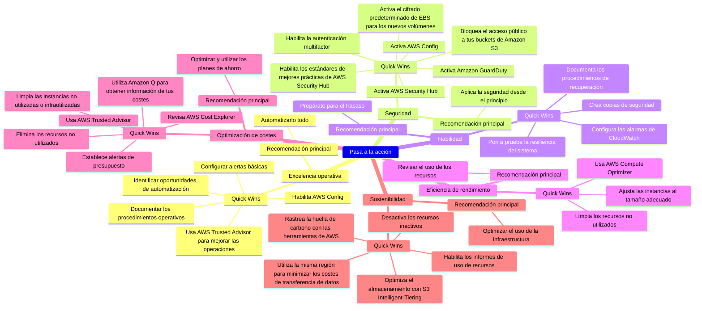

---

En todos los artículos utilizaré los términos en inglés *AWS Well-Architected* y *AWS Well-Architected Framework*, porque en el ámbito profesional están más extendidos.

---

## 1. Qué es un Quick Win y su relación con el Framework

Los *Quick Wins* son esas **acciones rápidas y sencillas que puedes realizar hoy mismo para obtener mejoras inmediatas** en tu arquitectura de AWS.

Para los equipos que se inician con el AWS Well-Architected Framework, los Quick Wins son cruciales. Proporcionan resultados tangibles sin la necesidad de una reestructuración completa, permitiendo optimizar el rendimiento, la seguridad y los costes de forma ágil y sentando las bases para iniciativas arquitectónicas más amplias.

> Abordar los *Quick Wins* al principio permite a los equipos evidenciar valor y facilitar la justificación de estrategias más profundas a futuro.
{: .prompt-tip }

---

## 2. Pasa a la acción: Quick Wins por Pilar

> Información más práctica.
{: .prompt-info }

Esta guía ofrece un desglose pilar por pilar de los *Quick Wins* que pueden ayudarte a avanzar hacia la excelencia en tu arquitectura de AWS.

### 2.1 Pasa a la acción: Excelencia Operacional

> **Recomendación principal**: Automatiza todo lo que puedas para minimizar los errores humanos y mejorar la eficiencia operativa.
{: .prompt-tip }

- **Quick Wins**:
  1. **Documentar los procedimientos operativos**: crea un documento compartido para los procesos clave.
  2. Revisa tus procedimientos operativos con regularidad e **identifica las oportunidades en las que la automatización puede mejorar la eficiencia** y ahorrar un tiempo valioso.
  3. **Configurar alertas basicas**: usa AWS CloudWatch para crear alertas de monitorización básicas para servicios críticos.
  4. **Habilita AWS Config** para hacer un seguimiento de los cambios de configuración y mejorar la auditoría.
  5. **Usa AWS Trusted Advisor** para identificar las mejoras operativas.

- **Otras recomendaciones importantes**:
  - Mejora continuamente tus procedimientos operativos mediante revisiones y comentarios frecuentes.
  - Céntrate en crear una cultura de responsabilidad y mejora continua.

### 2.2 Pasa a la acción: Seguridad

> **Recomendación principal**: Aplica la seguridad desde el principio y en todos los niveles.
{: .prompt-tip }

- **Quick Wins**:
  1. **Activa AWS Security Hub** para tener una visión centralizada de tus alertas de seguridad y del estado de cumplimiento.
  2. **Habilita los estándares de mejores prácticas de AWS Security Hub** para evaluar el cumplimiento y detectar posibles brechas de seguridad.
  3. **Activa Amazon GuardDuty** para detectar amenazas y supervisar las actividades no autorizadas en tiempo real.
  4. **Habilita la autenticación multifactor** en todas las cuentas de AWS.
  5. **Activa AWS Config**: evalúa continuamente la conformidad de tus recursos de AWS mediante las reglas de AWS Config.
  6. **Activa el cifrado predeterminado de EBS** para los nuevos volúmenes.
  7. **Bloquea el acceso público a tus buckets de Amazon S3**.

- **Otras recomendaciones importantes**:
  - Crea un enfoque de seguridad por capas que incluya la gestión de identidades, el cifrado y la protección de la red.
  - Evalúa y audita con regularidad tu postura de seguridad con comprobaciones de cumplimiento automatizadas.

### 2.3 Pasa a la acción: Fiabilidad

> **Recomendación principal**: Prepárate para el fracaso; asume que los servicios fallarán y diseña para una recuperación sin problemas.
{: .prompt-tip }

- **Quick Wins**:
  1. **Configura las alarmas de CloudWatch**: Crea alarmas para las métricas de los recursos críticos (CPU, memoria) para detectar los problemas de forma temprana.
  2. **Crea copias de seguridad**: centraliza y automatiza las copias de seguridad en todos tus servicios con AWS Backup.
  3. **Documenta los procedimientos de recuperación**: describe rápidamente los pasos de recuperación de tus servicios clave en caso de incidente.
  4. **Pon a prueba la resiliencia del sistema**: Usa *AWS Fault Injection Simulator* para realizar pruebas de inyección de errores, como simular un fallo de servicio o una interrupción de la red.

- **Otras recomendaciones importantes**:
  - Garantiza la redundancia y la tolerancia a los fallos en todos los niveles de tu arquitectura.
  - Implementa la supervisión proactiva y la recuperación automática de los servicios clave.

### 2.4 Pasa a la acción: Eficiencia en el Rendimiento

> **Recomendación principal**: Revisa continuamente el uso de los recursos para asegurarte de que no estás sobreaprovisionado.
{: .prompt-tip }

- **Quick Wins**:
  1. **Usa AWS Compute Optimizer**: activa Compute Optimizer para recibir recomendaciones sobre cómo ajustar el tamaño de tus instancias y otros recursos.
  2. **Ajusta las instancias al tamaño adecuado**: usa AWS Trusted Advisor para revisar y ajustar los tamaños de las instancias EC2 y lograr un rendimiento y un coste óptimos.
  3. **Limpia los recursos no utilizados**: identifica y termina las instancias EC2, los volúmenes de EBS y otros recursos no utilizados para mejorar la eficacia.

- **Otras recomendaciones importantes**:
  - Optimiza y escala los recursos con regularidad para satisfacer la demanda de manera eficiente.
  - Aprovecha los servicios gestionados o sin servidor para minimizar la gestión de la infraestructura y centrarse en el rendimiento.

### 2.5 Pasa a la acción: Optimización de Costes

> **Recomendación principal**: Optimiza siempre ajustando el tamaño y utilizando los planes de ahorro siempre que sea posible.
{: .prompt-tip }

- **Quick Wins**:
  1. **Usa AWS Trusted Advisor** para recibir información sobre las oportunidades de ahorro de costes en tus servicios de AWS.
  2. **Establece alertas de presupuesto**: usa los *Budgets* de AWS para crear umbrales de costes y recibir alertas si superas tu presupuesto.
  3. **Revisa AWS Cost Explorer**: analiza tus costes y patrones de uso de AWS en el panel de Cost Explorer para mejorar la eficiencia financiera.
  4. **Elimina los recursos no utilizados**: Revisa y cancela con regularidad cualquier recurso no utilizado o infrautilizado para minimizar los costes.
  5. Limpia las instancias no utilizadas o infrautilizadas.
  6. Utiliza Amazon Q para obtener información de tus costes y de cómo puedes optimizar costes. Puedes preguntar con lenguaje natural.

- **Otras recomendaciones importantes**:
  - Adopta un modelo de consumo que fomente la eficiencia de los recursos y la sostenibilidad financiera.

### 2.6 Pasa a la acción: Sostenibilidad

> **Recomendación principal**: Optimiza el uso de la infraestructura adoptando servicios gestionados y sin servidores en aras de la sostenibilidad.
{: .prompt-tip }

- **Quick Wins**:
  1. **Desactiva los recursos inactivos**: automatiza el apagado de los recursos no críticos fuera del horario laboral.
  2. **Optimiza el almacenamiento**: revisa tus *Buckets* de Amazon S3 y utiliza *S3 Intelligent-Tiering* para optimizar los costes de almacenamiento en función de los patrones de acceso.
  3. **Habilita los informes de uso de recursos**: configura los informes para rastrear y optimizar el uso de los recursos en aras de la sostenibilidad medioambiental.
  4. Minimiza los costes de transferencia de datos manteniendo las cargas de trabajo y los recursos en la misma región.
  5. Haz un seguimiento de tu huella de carbono en AWS con la herramienta de *AWS Customer Carbon Footprint*.

- **Otras recomendaciones importantes**:
  - Aprovecha los servicios gestionados de AWS para beneficiarte de la infraestructura de eficiencia energética de AWS.
  - Reduce tu huella de carbono optimizando el uso de los recursos y utilizando la energíaServicios muy eficientes.
  - Automatiza la gestión de los recursos para minimizar el impacto medioambiental y reducir los costes operativos.

### 2.7. Visualizing the Quick-Wins

---

## 3. Conclusión

Los *quick wins* mosterados ofrecen un `excelente punto de partida` para aplicar las mejores prácticas de AWS Well-Architected de forma rápida.

Sin embargo, **para optimizar al máximo** tus cargas de trabajo y garantizar que sigues las mejores prácticas en todos los pilares, **es necesaria una revisión más exhaustiva**, y aquí es donde entra en juego el servicio del AWS Well-Architected Tool.

En el **siguiente artículo** explicaré cómo usar este servicio (`AWS Well-Architected Tool`), que te permitirá evaluar tus cargas de trabajo, identificar los puntos débiles e implementar mejoras a largo plazo. Accede al articulo [aquí](/es/posts/how-the-aws-well-architected-tool-can-transform-your-cloud-architecture/).

<!-- También puedes obtener más información en los siguientes recursos de AWS:

- [AWS Well-Architected Framework](https://docs.aws.amazon.com/wellarchitected/latest/framework/welcome.html){:target="_blank"}
- [Laboratorios del Well-Architected](https://www.wellarchitectedlabs.com/){:target="_blank"}
- [Herramienta de mapas en línea](https://wa.aws.amazon.com/wat.map.en.html){:target="_blank"} -->
